<!-- omit in toc -->
# Github desktop

Ce logiciel va faire partie de vos meilleurs amis au même titre que VSCode et Emmet (qu'on verra très bientôt).

Le principe de Github Desktop est d'offrir une interface graphique à Git. Ce dernier étant un petit logiciel qui va nous aider à travailler de manière efficace sur nos différents projets solo ou en équipe! C'est un logiciel est massivement utilisé en entreprise et peut sembler (pas que) très complexe. On va essayer de simplifier au max pour ce cours. Tu devras sûrement peaufiner tes compétences en Git plus tard!

Voyons ensemble les termes et techniques à connaître pour devenir un pro de Git!

<!-- omit in toc -->
## Table des matières

- [Git](#git)
- [Github](#github)
- [Repository](#repository)
- [.gitignore](#gitignore)
- [Installation GitHub Desktop](#installation-github-desktop)
- [Ajouter un projet, cloner un projet](#ajouter-un-projet-cloner-un-projet)
  - [Une autre façon d'ajouter un repository](#une-autre-façon-dajouter-un-repository)
- [Naviguer avec Github Desktop](#naviguer-avec-github-desktop)
- [Changes et discard changes](#changes-et-discard-changes)
- [Commit](#commit)
- [Push](#push)
- [Fetch \& Pull](#fetch--pull)
- [Les branches](#les-branches)
  - [Créer une nouvelle branche](#créer-une-nouvelle-branche)
  - [Fusionner des branches (merge)](#fusionner-des-branches-merge)
  - [Supprimer une branche](#supprimer-une-branche)
- [Conclusion](#conclusion)

## Git

Git est un logiciel dit de `versioning` qui s'installe sur votre ordinateur et qui permet de surveiller tous les changements dans vos fichiers d'un dossier de projet. Il va pouvoir garder en mémoire chaque changement de ligne de code. Vous allez pouvoir sauvegarder différent états de votre projet et créer des `branch` pour continuer à développer votre app ou site sans risquer de faire une bêtise qui casserait votre projet.

C'est également un outil qui va permettre de travailler à plusieurs sur le même projet et de régler les conflits qui se produiraient si vous avez éditer les mêmes lignes de codes.

Normalement Git s'utilise en ligne de commande dans un terminal. Mais c'est déjà un concept pas facile à appréhendez, du coup nous allons plutôt utiliser une interface dédié: Github Desktop.

## Github

Github est un site internet qu'on pourrait décrire comme étant un réseau social de programmeurs. Il va permettre de publier votre code pour le rendre open-source et ainsi pouvoir profiter de l'expertise d'autres développeurs qui voudront aider au développement de votre app. Il n'est pas nécessaire de rendre son code public, vous pouvez aussi travailler en interne sur des `repository` privé.

## Repository

Un repository c'est un peu comme une gros dossier qui contient tous les fichiers de  votre projet. Il va stocker les fichiers sources, les fichiers générés par des framework et garde aussi une trace de l'historique des changements dans vos fichiers.

Un exemple concret, votre site web fonctionne bien et vous décider de faire une mise à jour. A cause des modifications que vous venez de faire votre site est inutilisable, quoi que vous fassiez impossible de trouver la source du problème. Vous avez grâce à Git la possibilité de revenir en arrière en parcourant votre historique !

## .gitignore

Il y a certains fichiers qu'il ne faut jamais publier sur Github, pour des raisons de sécurité et/ou de confidentialité. Le fichier `.gitignore` existe pour exclure de l'envoi les fichiers que vous ne devez pas publier. Je vous recommande fortement de prendre l'habitude de toujours créer ce fichier à **chaque nouveau projet**.

Un exemple serait le dossier `node_modules` d'un projet NPM. Il s'agit d'un dossier qui contient tout un tas de librairies JavaScript pour exécuter un projet. Ce dossier apparaît quand vous créer un projet avec un framework notamment (Astro, React,..)

## Installation GitHub Desktop

1. Il va te falloir un compte [Github](https://github.com/). 
2. Télécharger et installer la version Windows de Github Desktop via ce [lien](https://desktop.github.com/). Pour les utilisateurs de Mac ou de Linux, le site devrait vous proposer la bonne version.
3. Une fois le programme installé, ouvre-le et connecte toi avec ton compte précédemment créé.

## Ajouter un projet, cloner un projet

Si tu as bien lié ton compte github.com à Github Desktop, lorsque tu cliques sur le menu déroulant en haut à gauche du programme :

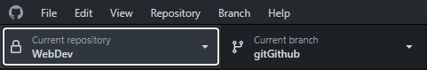

Tu auras la possibilité d'ajouter un repository au programme Github Desktop :

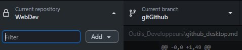

En cliquant sur le bouton *Add* ou *Ajouter* tu auras 3 possibilités :

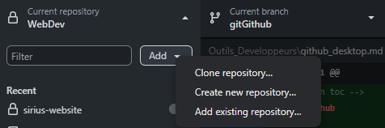

- **Clone repository**: Cette option te permet de cloner un projet existant sur Github.com qui t'appartient ou dont tu possède l'url.

- **Create new repository**: Cette option te permet de créer un repository totalement vierge. Cette modal apparaîtra :

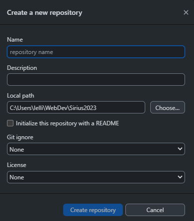

> Si tu souhaites le publier directement sur Github.com et commencé le tracking, il faut cliquer sur **Publish repository**

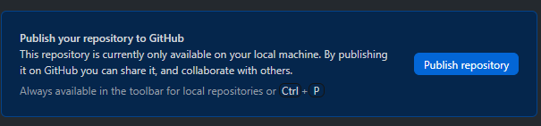

- **Add existing repository**: Cette option permet d'ajouter un dossier qui est déjà un tracké par Git mais pas encore disponible sur Github.com. Tu dois choisir le dossier de ton projet dans le modal suivant :

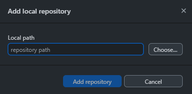

### Une autre façon d'ajouter un repository

Si un projet qui est déjà sur Github.com mais pas sur Github Desktop ni sur ta machine, tu peux l'ajouter directement cliquant sur le bouton vert **code** puis sur **"Open with Github Desktop"** :

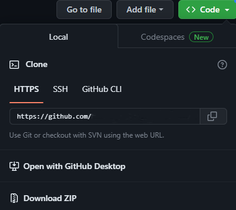

## Naviguer avec Github Desktop

Tu peux aussi voir la liste de tes projets dans le menu déroulant

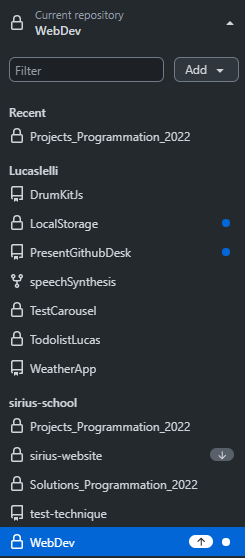

Si tu cliques droit sur l'un de tes projets plusieurs options s'offrent à toi :

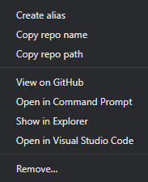

Voici celles qui nous intéresse :

- **View on GitHub** : permet de voir le projet sur github.com.
- **Show in Explorer** : permet d'ouvrir le dossier à l'emplacement du fichier de votre machine.
- **Open in Visual Studio Code** : permet d'ouvrir le dossier du projet directement dans VSCode.
- **Remove** : permet de supprimer le dossier du projet de Github Desktop, vous pouvez aussi cocher l'option pour le supprimer de votre machine.

## Changes et discard changes

Dès que vous modifier une ligne de code, ne serais-ce que d'un caractère (même un espace!), Git le détecte et vous indique avoir perçu le changement. Il surveille aussi les ajouts et suppressions de fichiers. Cela est indiqué dans la colonne de gauche de Github Desktop. Le petit symbole à droite du fichier vous indique aussi le type de changement détecté.

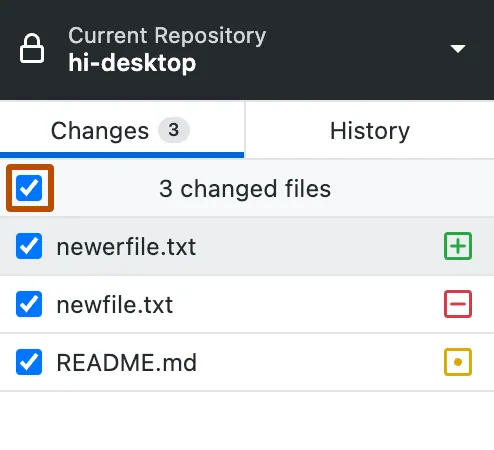

- L’icône rouge indique des fichiers supprimés.
- L’icône jaune indique des fichiers modifiés.
- L’icône verte indique des fichiers ajoutés.

Avec *Github Desktop* vous avez la possibilité de supprimer les changements fichier par fichier. En cliquant droit sur l'un des éléments modifiés dans la liste de gauche et en sélectionnant **Discard changes...**. :exclamation: Cette action est irréversible!

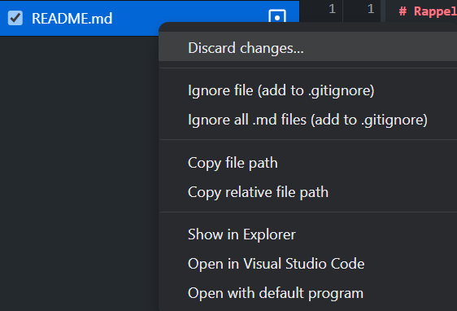

## Commit

Lorsque vous avez finis de travailler sur un ou des fichiers et que vous voulez sauvegarder ces fichiers sur votre repository, il faut **commit** (valider) les changements. Un commit représente une étape dans l'historique de votre projet. On en fait à chaque moment clé de son travail pour pouvoir revenir en arrière en cas de pépin.

En bas à gauche du programme, vous avez un champ qui vous permet d'ajouter un message à votre commit. Il est super important de noter les changements que vous avez effectués dans votre code. Un bon message vous permettra de vous y retrouver plus facilement si vous devez revenir en arrière. Même si il est possible d'ajouter une description c'est purement facultatif.

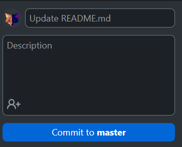

Il ne reste plus qu'à cliquer sur le bouton **"Commit to *[Nom de votre branche actuelle]*"** et le tour est jouer, votre commit est enregistré.

## Push

Une fois les changements validés avec le commit, il faut encore envoyer ces changements sur Github.com. Car pour le moment ces modifications sont enregistrés en local sur votre machine.

Deux façons de Push s'offrent à vous. Lorsque vous effectuez un commit, Github Desktop est assez malin pour vous proposer de Push directement :

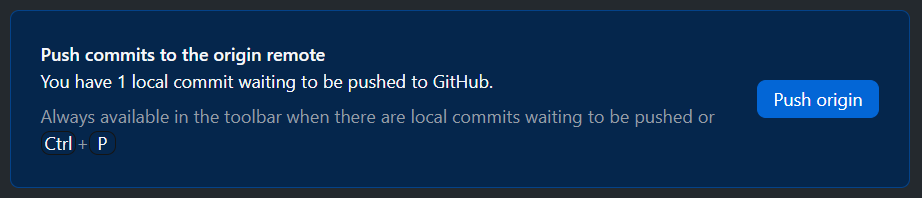

La deuxième façon est de le faire sur le bouton juste à coté des branches :

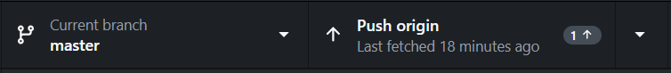

## Fetch & Pull

Si vous travaillez à plusieurs ou sur une autre machine, vous devez récupérer les modifications qui ont été **push**. Pour ce faire, il faut d'abord **fetch** (récupérer) les changements sur le **repo**. Ensuite il faut **pull** (tirer) ces changement depuis Github.com vers notre machine.

Le "fetch" se fait quasiment automatiquement lorsque vous sélectionner un repository sur Github Desktop, il va donc comparé la version en ligne et la version sur votre machine. Si la version en ligne est plus récente, le programme vous proposera de "Pull".

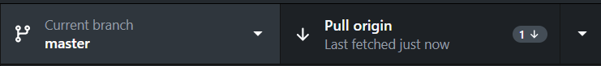

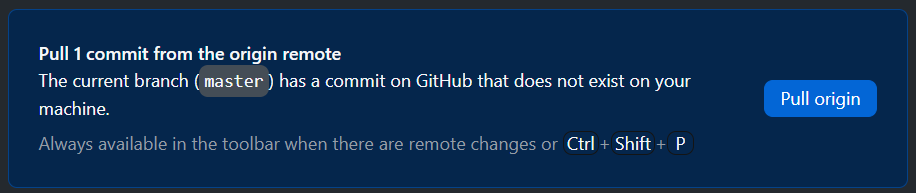

## Les branches

Une branche sur Git est comme une version parallèle de votre projet. Imaginez que vous avez un livre et que vous souhaitez essayer différentes fins sans affecter l'histoire principale. Vous créez donc des copies du livre (des branches) où vous pouvez librement écrire et tester ces nouvelles fins. Chaque branche permet de développer des fonctionnalités, corriger des bugs ou expérimenter sans toucher à la version principale (souvent appelée "main" ou "master"). Une fois satisfait des modifications, vous pouvez fusionner (merge) ces branches avec la principale pour intégrer les changements.

### Créer une nouvelle branche

1. Ouvrez GitHub Desktop. Si vous avez déjà cloné un dépôt, il apparaîtra dans la liste des dépôts disponibles. Sinon, vous devrez cloner un dépôt en utilisant l'URL du dépôt distant.

2. Une fois que vous avez sélectionné le dépôt sur lequel vous souhaitez travailler, assurez-vous d'être sur l'onglet "Current repository" (dépôt actuel) dans GitHub Desktop.

3. En haut de la fenêtre de l'application, vous verrez un bouton avec le nom de la branche actuelle. Cliquez sur ce bouton pour afficher une liste déroulante des branches disponibles.

4. Dans la liste déroulante, cliquez sur l'option "New branch" (Nouvelle branche). Une fenêtre contextuelle s'ouvrira vous demandant de donner un nom à votre nouvelle branche.

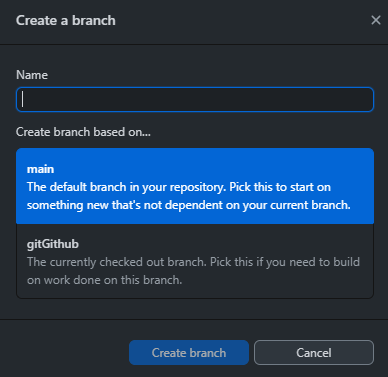

5. Entrez un nom qui décrit la fonctionnalité que vous souhaitez créer pour votre nouvelle branche. Il est courant d'utiliser des noms qui décrivent la fonctionnalité ou le correctif que vous allez développer.

6. Vous pouvez également choisir de créer la nouvelle branche à partir de la branche actuelle ou d'une autre branche disponible. Par défaut, GitHub Desktop sélectionnera automatiquement la branche actuelle.

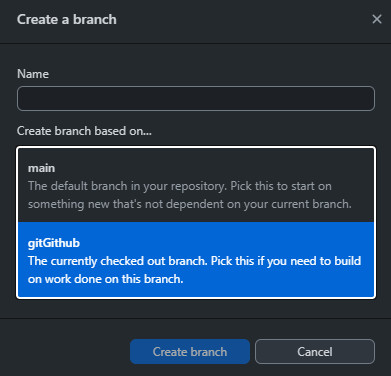

7. Une fois que vous avez donné un nom à votre nouvelle branche et sélectionné la branche de départ, cliquez sur le bouton "Create branch" (Créer une branche).

8. GitHub Desktop créera maintenant la nouvelle branche localement sur votre ordinateur. La nouvelle branche apparaîtra dans la liste déroulante des branches en haut de la fenêtre.

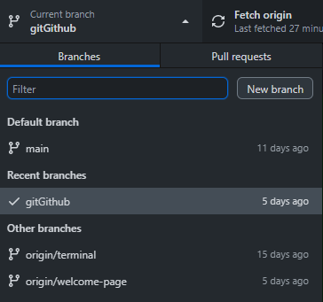

9. Pour publier votre nouvelle branche sur GitHub, cliquez sur le bouton "Publish branch" (Publier la branche) à côté de la nouvelle branche dans la liste déroulante. Cela enverra la branche sur le dépôt distant correspondant sur GitHub.

Vous avez créé avec succès une nouvelle branche sur GitHub Desktop. Vous pouvez maintenant commencer à travailler sur cette branche en effectuant des modifications, en ajoutant des fichiers, etc. N'oubliez pas de faire des **commits réguliers** pour enregistrer vos modifications et de pousser vos commits sur GitHub en utilisant le bouton "Push origin" dans GitHub Desktop. Notez que si vous travaillez en équipe, il est important de communiquer avec vos collègues pour vous assurer que vous ne travaillez pas sur des branches qui pourraient entrer en conflit !

### Fusionner des branches (merge)

1. Assurez-vous d'avoir terminé votre travail sur la branche que vous souhaitez fusionner avec la branche "main". Vous devez avoir effectué plusieurs commits et **poussé (push)** ces commits sur le dépôt distant.

2. Ouvrez GitHub Desktop et sélectionnez le dépôt dans lequel vous avez travaillé.

3. Assurez-vous d'être sur le bon repo dans l'onglet "Current repository" (dépôt actuel) dans GitHub Desktop.

4. Dans la liste déroulante des branches, sélectionnez la branche que vous voulez mettre à jour. La branche sélectionnée sera votre branche actuelle. Cliquez sur le bouton de la branche actuelle pour afficher la liste déroulante des branches.

5. Dans la liste déroulante, vous verrez l'option "Choose a branch to merge into [le nom de votre branche actuelle]" (Choisir une branche à fusionner avec). Sélectionner la branche qui doit nourrir votre branche actuelle. Ceci va amener vos changements sur la branche actuelle de la branche que vous avez sélectionné.

6. Après avoir sélectionné la branche, cliquez sur le bouton "Merge branch" (Fusionner la branche). Cela déclenchera le processus de fusion entre votre branche actuelle et la branche sélectionnée.

7. GitHub Desktop effectuera la fusion automatiquement en créant un nouveau commit de fusion. Si des conflits surviennent pendant la fusion, GitHub Desktop vous le signalera et vous devrez les résoudre manuellement. Suivez les instructions fournies par GitHub Desktop pour résoudre les conflits.

8. Une fois que la fusion est terminée avec succès, vous pouvez pousser le commit de fusion sur le dépôt distant en cliquant sur le bouton "Push origin" (Pousser l'origine) dans GitHub Desktop.

Assurez-vous que la fusion a été correctement effectuée dans votre dépôt (repository) sur GitHub.com.

### Supprimer une branche

⚠️ ATTENTION ⚠️ Une suppression est définitive, vérifiez que tout votre travail a bien été fusionné avec votre branche principale avant toute manipulation dans le menu de suppression.

1. Ouvrez GitHub Desktop et sélectionnez le dépôt contenant la branche que vous souhaitez supprimer.

2. Assurez-vous d'être sur l'onglet "Current repository" (dépôt actuel) dans GitHub Desktop.

3. Dans la liste déroulante des branches, cliquez droit sur la branche que vous souhaitez supprimer.

4. Une liste d'options apparaît dont l'option 'delete' cliquez sur cette option.

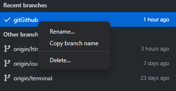

5. Une fenêtre contextuelle apparaîtra pour confirmer la suppression de la branche. Vérifiez une fois de plus que vous souhaitez bien supprimer la branche, car **cette action est irréversible**.

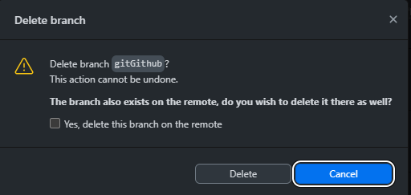

6. Cochez 'Yes, delete this branch on the remote' (Oui, supprimer cette branche sur le dépôt distant) si vous souhaitez supprimer la branche aussi bien en local, sur votre machine et sur Github.com.

Notez que si d'autres collaborateurs travaillent sur la même branche ou si vous avez déjà fusionné des commits sur d'autres branches, il est recommandé de ne pas supprimer la branche immédiatement, car cela peut entraîner la perte des commits et de l'historique de la branche. Dans ce cas, il est préférable de conserver la branche ou de la supprimer ultérieurement une fois qu'elle n'est plus nécessaire.

## Conclusion

Git et Github sont des outils indispensables pour un développeur et pour travailler en équipe. Il y a beaucoup d'avantage quand on l'utilise bien et nous aurons tout le reste de la formation pour se familiariser avec ce formidable outil.

**Fini les clés USB, Github est là !**

> Hey psstt, c'est Jerem, on a fait du mieux qu'on pouvait avec Lucas pour écrire un cours sur Git et Github, mais c'est un sujet pas facile à aborder. Alors accroche toi, pose des questions quand ça va et n'hésite pas à allez faire un tour dans [la documentation officielle](https://docs.github.com/fr/desktop).

[:arrow_up: Revenir au top](#table-des-matières)

[:rewind: Retour au sommaire du cours](../../README.md)

> Cours rédigé par [Lucas Ielli](https://github.com/LucasIelli)
>
> Relecture et correction par [Jeremy Scala](https://github.com/scalajeremy)
>
> Utilisation de ChatGPT pour la génération de certaines explications
