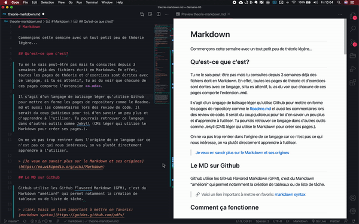

# Markdown

## Qu'est-ce que c'est?

Tu ne le sais peut-être pas mais tu consultes depuis le début déjà des fichiers écrit en Markdown. En effet, toutes les pages que tu consulte sur Github pour le moment sont écrites avec ce langage, si tu es attentif, tu as du voir que chacune de ces pages comporte l'extension **.md**.

Il s'agit d'un langage de balisage léger qui est utilisé par Github (et autres) pour mettre en forme les pages de repository comme le Readme.md et aussi les commentaires lors des review de code. Il serait du coup judicieux pour toi d'en savoir un peu plus et d'apprendre à l'utiliser. Tu pourrais retrouver ce langage dans d'autres outils comme Astro, Jekyll,... qui sont des CMS léger qui utilise le Markdown pour créer ses pages.Même Trello utilise le Markdown dans ses commentaires.

On ne va pas trop rentrer dans l'origine de ce langage car ce n'est pas ce qui nous intéresse, on va plutôt directement apprendre à l'utiliser.

> [Je veux en savoir plus sur le Markdown et ses origines](https://en.wikipedia.org/wiki/Markdown)

## Le MD sur Github

Github utilise les GitHub Flavored Markdown (GFM), c'est du Markdown "amélioré" qui ajoute des fonctionnalités qui permettent notamment la création de tableaux ou de liste de tâche.

> :link: Voici un lien important à mettre en favoris: [Syntaxe de base pour l’écriture et la mise en forme](https://docs.github.com/fr/get-started/writing-on-github/getting-started-with-writing-and-formatting-on-github/basic-writing-and-formatting-syntax)

## Comment ça fonctionne

> :heavy_exclamation_mark: La mise en page est très importante en Markdwon. Si vous voulez mettre à la ligne votre texte il vous faudra bien espacer vos deux paragraphes par une ligne vide

```md
Paragraphe 1

Paragraphe 2
```

### 

### Headers

```md
# Titre 1
## Titre 2
### Titre 3
...
```

**Résultat:**

# Titre 1

## Titre 2

### Titre 3

> L'équivalent en HTML des balises \<h1>, \<h2>,... que nous verrons bientôt.

### Emphasis

```md
*Italique*
**Bold**
*Combiné **plusieurs** style*
```

**Résultat:**

*Italique*

**Bold**

*Combiné **plusieurs** style*

> L'équivalent en HTML de \<strong> et \<em>

### Blockquote

```md
> Ceci est une citation
>
> Si vous voulez faire un saut à la ligne, il faut remettre une balise vide
```

Résultat:
> Ceci est une citation
>
> Si vous voulez faire un saut à la ligne, il faut remettre une balise vide

### Lists

```md
* Item 1
* Item 2
  * Item 2a
  * Item 2b

1. Item 1
2. Item 2
   * Item 2a
   * Item 2b
```

**Résultat:**

* Item 1
* Item 2
  * Item 2a
  * Item 2b

1. Item 1
2. Item 2
   * Item 2a
   * Item 2b

> L'équivalent en HTML de \<ol> et \<ul>

### images

```md

```

> L'équivalent en HTML de \

### Liens

```md
[exercices](exercices.md)
[exercices CSS](exercices.md#Les-exercices-css)
```

> :bulb: Vous pouvez également faire des liens vers des titres de votre document. Pour ce faire il faut ajouter un # et le titre en remplaçant les éventuels espaces par des tirets.

> L'équivalent en HTML de \<a>

### List de tâche

```md
- [ ] Tâche non-accompli
- [x] Tâche accomplie
```

**Résultat:**

- [ ] Tâche non-accompli
- [x] Tâche accomplie

### Tableaux

```md
Header 1 | Header 2
----------|---------
Cellule 1 | Cellule 2
```

**Résultat:**

Header 1 | Header 2
----------|---------
Cellule 1 | Cellule 2

### Bloc de code

Il est possible d'insérer du code dans un bloc avec la syntaxe en couleur, c'est ce que vous voyez depuis un moment sur les pages de théories. Voici comment faire:

* Placez 3 ` (backtick)
* Suivez vos backtick par le nom du langage (JS, MD, HTML, CSS,...)
* :warning: Placez votre code à la ligne suivante.
* Fermer votre code avec de nouveau 3 ` (backtick) à la ligne suivante.

### Un peu de couleur avec les emojis

Github supporte les emojis.

[Emoji Cheat Sheet](https://github.com/ikatyang/emoji-cheat-sheet/blob/master/README.md)

```md
:bulb: :alien: :japanese_goblin:
```

**Résultat:**

:bulb: :alien: :japanese_goblin:

## Petite astuce

Le Markdown prend en compte l'HTML que vous intégrez à votre document. Il est conseillé de ne pas en utiliser de trop. L'intérêt du MD est de justement proposer des mises en page simple et ordonnée. Le problème c'est que si vous voulez parler d'une balise en particulier et que vous la mettez en "dur" dans le commentaire, Github va  l'interpréter comme une balise HTML classique et va tenter de l'afficher correctement. Pour insérer une balise sans que Github la prenne en compte il suffit d'insérer un backslash devant votre balise

```md
<a> // va tenter de faire un lien
\<a> // va afficher votre balise en dur dans votre message
```

## Quelques plugin intéressant pour rédiger du MD



[Markdown Preview Github Styling](https://marketplace.visualstudio.com/items?itemName=bierner.markdown-preview-github-styles)
Lorsque vous aurez besoin d'écrire des Readme pour vos repository, ce plugin vous permettra d'afficher une prévisualisation en direct de votre document avec le style de Github, vous pourrez vérifier si votre contenu s'affiche correctement.

[Markdown Emoji](https://marketplace.visualstudio.com/items?itemName=bierner.markdown-emoji) permet d'ajouter le support des emojis dans la prévisualisation.

[Markdown All in One](https://marketplace.visualstudio.com/items?itemName=yzhang.markdown-all-in-one) ajoute des tas de fonctionnalités pour mieux rédiger vos documents. Il peut par exemple faire vos listes automatiquement quand vous passez à la ligne suivante, il vous aide à insérer des images et des liens plus facilement,... bref, si vous avez beaucoup de rédaction en MD a faire c'est un incontournable.

[Markdownlint](https://marketplace.visualstudio.com/items?itemName=DavidAnson.vscode-markdownlint) ajoute des aides visuels pour vous aidez à respecter les conventions d'écritures du MD.
