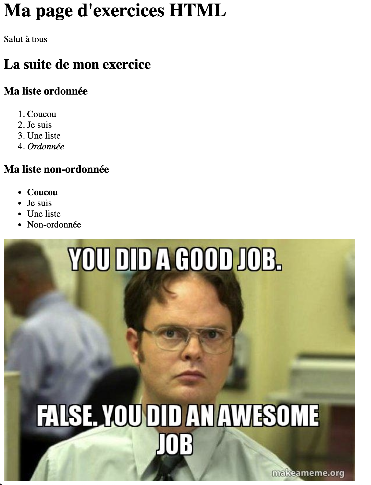
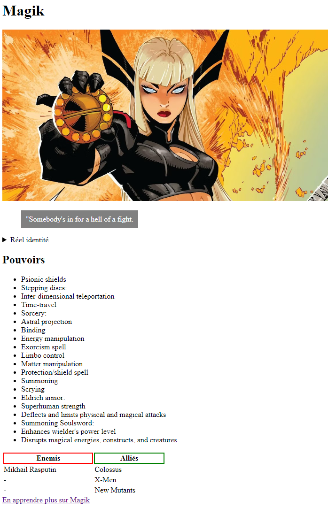
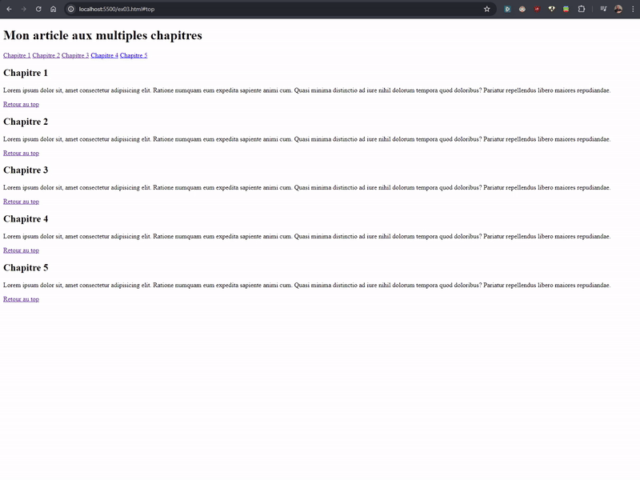

<!-- omit in toc -->
# Exercices intermédiaires

Voici quelques exercices simples pour apprendre à manipuler un peu toutes les balises HTML qu'on vient de voir.

<!-- omit in toc -->
## Légende des difficultés

Facile: 😄
Modéré: 😊
Exigeant: 😅
Épineux: 😰
Impossible?: 😡

<!-- omit in toc -->
## Liste des exercices

- [😊 Exercice 0](#-exercice-0)
- [😄 Exercice 1](#-exercice-1)
- [😅 Exercice 2 (optionnel)](#-exercice-2-optionnel)
- [😊 Exercice 3 (optionnel)](#-exercice-3-optionnel)

<!-- omit in toc -->
## :memo: Objectifs

- Réaliser sa première page HTML en utilisant les balises vues dans la théorie
- Suivre des consignes précises

<!-- omit in toc -->
## :white_check_mark: Evaluations

- Respect des consignes
  - La page présente tous les éléments demandés
- La syntaxe est correcte
- L'indentation est correcte

## 😊 Exercice 0

Avant de te lancer, si tu veux tu peux revoir ce dont on a déjà parlé dans le cours en réalisant [les exercices sur W3School](https://www.w3schools.com/html/exercise.asp?filename=exercise_html_attributes1).

Sujets déjà abordés (correspondant aux sections des exercices sur W3School):

- Attributes
- Headings
- Paragraphs
- Comments
- Links
- Images
- Tables
- Lists
- Classes
- ID

> :exclamation: Il y a sûrement des réponses que tu ne trouveras pas car nous ne l'avons pas spécialement vu dans le cours. Mais tu peux retrouver un lien vers la documentation du sujet concerné si tu veux essayer de trouver par toi même. N'hésite pas à poser des questions!

[Revenir à la liste des exercices](#liste-des-exercices)

## 😄 Exercice 1

<!-- omit in toc -->
### Etape 1

Il est temps de réaliser ta première page. Suis bien ce pas-à-pas.

1. Ouvre VSCode
2. Crée un nouveau document `HTML` et nomme le `exercice-1.html`.
3. Sauvegarde-le dans un dossier `03-exercices-intermediaires-html` dans le dossier `Mes Documents\Sirius2024` de ton ordinateur.
4. Écris le squelette de base d'une page HTML avec l'abréviation d'Emmet (!)
5. Ajoute un `paragraphe` et écris une petite phrase pour saluer le visiteur.

<!-- omit in toc -->
### Etape 2

1. Toujours dans le même document, ajoute un `Titre de niveau 1` au dessus de ton paragraphe en indiquant la phrase suivante `Ma page d'exercices HTML`
2. Dans le balise `Head` tu trouveras la balise `Title`. Change donc le titre par celui que l'on vient d'ajouter plus haut (Ma page d'exercices HTML)

<!-- omit in toc -->
### Etape 3

1. Toujours dans le même document, ajoute un `Titre de niveau 2` en dessous de ton paragraphe et indique la phrase suivante `La suite de mon exercice`
2. Englobe ton `titre 1` et son paragraphe dans une balise `div`
3. Englobe ton `titre 2` dans une balise `div` différente.

<!-- omit in toc -->
### Etape 4

1. Ajoute une balise `titre 3` à la suite de ton titre de niveau 2 (à l'intérieur de la `
`) et indique `Ma liste ordonnée`
2. Crée une liste ordonnée à la suite de ton titre 3 avec 4 `list item` au choix.
3. Ajoute un `titre 3` à la suite de cette liste (toujours dans la `
`) et indique `Ma liste non-ordonnée`
4. Crée une liste non-ordonnée à la suite de ton titre 3 avec 4 `list item` au choix.

<!-- omit in toc -->
### Etape 5

1. Mets quelques mots en évidence dans tes listes avec les balises `em`, `strong` ou place des `span` qui serviront dans un future exercice et donne leurs une `class` qui a du sens.
2. Mets une `image` en dessous de ta page.
3. Fais en sorte que quand on clique sur ton image on arrive sur le site de Google.

<!-- omit in toc -->
### Résultat

Tu devrais avoir quelque chose dans ce goût-là. Si c'est le cas, tant mieux tu peux passer à [l'exercice suivant](4-exercice-recette.md). Sinon, revois la théorie et pose des questions!

[Revenir à la liste des exercices](#liste-des-exercices)

## 😅 Exercice 2 (optionnel)

Dans cet exercice je vais te guider pour faire une mise en page un rien plus complexe. On va aussi mettre un peu de style. Alors oui, on a pas encore vu de CSS, mais je te donne les consignes. Si tu es à l'aise avec le CSS ou l'anglais, tu peux essayer de le modifier.

1. Crée un nouveau document avec son squelette HTML classique.
2. Dans la balise `<body>` place une `div` avec la classe `hero`
3. A l'intérieur de cette `div` place une image de ton super-héro préféré.
4. Rajoute un titre de niveau 1 pour indiquer son nom de super-héro **au-dessus** de l'image.
5. Utilise les attributs `width` et/ou `height` pour que ton image soit adapté à ta page (ne dépasse pas de la largeur maximum de ta fenêtre), tu peux utiliser des pixels mais des pourcentages serait mieux... On veut que notre image fasse toute notre page, l'entièreté...
6. Rajoute une citation (avec la bonne balise) de ton super-héro.
7. Ajoute ensuite son identité réelle (ex: Spider-man => Peter Parker) dans une balise `details` avec comme mot-clé "Réel identité" et cache ainsi son nom.
8. Rajoute une liste non-ordonné de ses pouvoirs.
9. Rajoute un tableau avec une colonne `ennemis` et `alliés` et listes quelques uns des ennemis et alliés de ton super-héro.
10. Ajoute l'attribut et la valeur suivante à ton tableau: `style="width: 50%;"`
11. Ajoute l'attribut et la valeur suivante à l'en-tête de ton tableau qui contient les ennemis: `style="border: red solid 2px;"`
12. Fait de même pour les alliés mais remplace la couleur rouge par du vert (green).
13. Rajoute ce style à la citation: `background: grey;color: white;width: fit-content;padding: 10px;"`
14. Ajoute un lien vers la page Wikipedia de ton super-héros

Voilà le résultat que tu devrais avoir.

## 😊 Exercice 3 (optionnel)

Allez on va terminer par une exercice simple mais sans pas-à-pas. Juste quelques consignes.

1. Crée une page html avec le titre principal "Mon article aux multiples chapitres"
2. Ajoute 5 liens vers 5 chapitres (ancres)
3. Ajoute 5 titres pour les 5 chapitres
4. Ajoute du texte de substitution (lorem)
5. Ajoute 5 liens qui ramène vers le titre principal

Tu peux utiliser le zoom de ton navigateur sur ta page pour agrandir le texte et avoir une barre de défilement verticale pour tester tes liens.

Voici le résultat souhaité. Fais bien attention à ta structure html, montre moi le résultat.

[:rewind: Retour au sommaire du cours](./README.md#table-des-matières)
