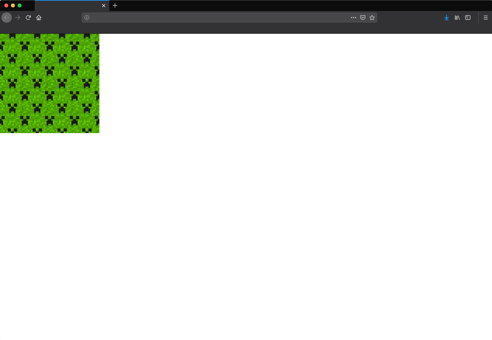
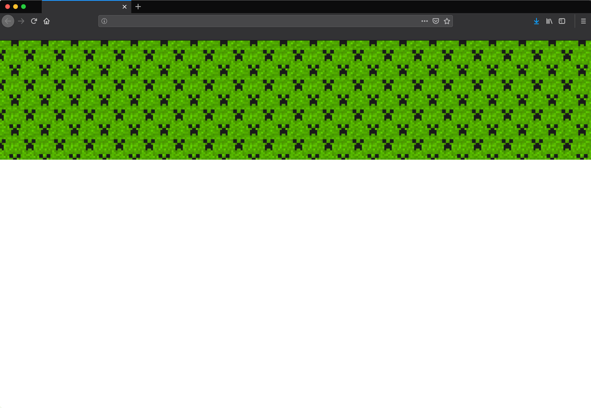
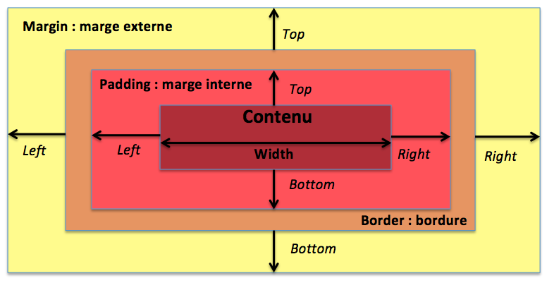
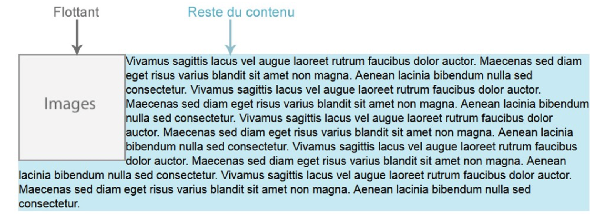
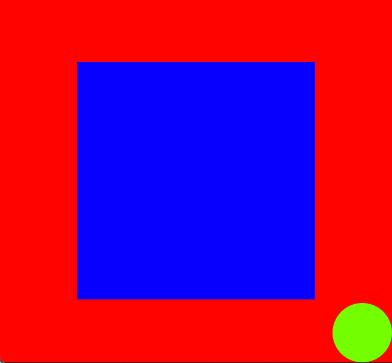
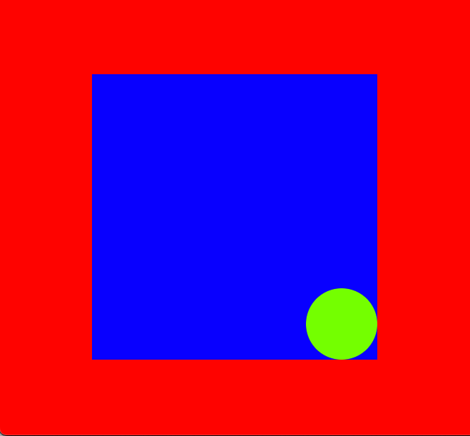

<!-- omit in toc -->
# Les propriétés CSS

Les propriétés CSS vont servir à changer nos éléments sélectionnées et à leurs donner du style! :sunglasses: Le soucis c'est que des propriétés il y en a beaucoup... vraiment beaucoup. On va commencer par voir les plus utiles pour construire nos pages web. il vous faudra fouiller la documentation CSS pour en trouver d'autre ou chercher des exemples sur [Codepen](http://www.codepen.io) (ou autre). N'hésitez pas non plus a faire des recherches Google pour trouver ce que vous souhaitez comme effet.

<!-- omit in toc -->
## Table des matières

- [Typographie](#typographie)
  - [font-family](#font-family)
  - [font-size](#font-size)
  - [font-weight](#font-weight)
  - [font-style](#font-style)
  - [line-height](#line-height)
  - [color](#color)
  - [text-align](#text-align)
  - [text-transform](#text-transform)
  - [text-decoration](#text-decoration)
  - [text-indent](#text-indent)
- [Bordure et arrière-plan](#bordure-et-arrière-plan)
  - [border](#border)
  - [border-radius](#border-radius)
  - [background-color](#background-color)
  - [background-image](#background-image)
  - [background-size](#background-size)
  - [background-repeat](#background-repeat)
  - [background-position](#background-position)
  - [background-attachment](#background-attachment)
  - [En une ligne](#en-une-ligne)
- [Display](#display)
  - [display: block](#display-block)
  - [display: inline](#display-inline)
  - [display: inline-block](#display-inline-block)
  - [display: none](#display-none)
- [Dimensions, margin et padding](#dimensions-margin-et-padding)
  - [width \& height (max \& min)](#width--height-max--min)
  - [Fit-content, max-content et min-content](#fit-content-max-content-et-min-content)
    - [Fit-content](#fit-content)
    - [Max-content](#max-content)
    - [Min-content](#min-content)
  - [object-fit \& object-position](#object-fit--object-position)
  - [Overflow](#overflow)
  - [margin \& padding](#margin--padding)
  - [box-sizing](#box-sizing)
  - [Calculer une largeur avec des marges avec la fonction calc()](#calculer-une-largeur-avec-des-marges-avec-la-fonction-calc)
  - [Centrer horizontalement grâce aux margin](#centrer-horizontalement-grâce-aux-margin)
- [Positionnement](#positionnement)
  - [float](#float)
  - [clear](#clear)
  - [Créer un affichage en colones](#créer-un-affichage-en-colones)
- [Position](#position)
  - [position: static](#position-static)
  - [position: fixed](#position-fixed)
  - [position: sticky](#position-sticky)
  - [position: absolute et relative](#position-absolute-et-relative)
  - [Z-index](#z-index)
  - [Attention à l'utilisation de position](#attention-à-lutilisation-de-position)
- [L'auto-complete de VSCode](#lauto-complete-de-vscode)

## Typographie

### font-family

```css
body{
  font-family: Arial, Helvetica, sans-serif;
}
```

Cette propriété définit la famille de police d'écriture à utiliser. Dans cet exemple, tout texte dans le `body` de votre page utilisera Arial en priorité, ensuite Helvetica si la police n'est pas disponible et pour finir n'importe quelle police sans-serif si les deux première ne sont pas sur l'ordinateur de l'utilisateur. 

Les types de polices disponnibles en HTML/CSS sont les suivants: Sans-serif, Serif, Monospace, Cursive, Fantasy. Plus d'infos sur [w3school](https://www.w3schools.com/css/css_font.asp)

Voici une liste des polices dites "safe" à utiliser sur vos pages web: [https://www.cssfontstack.com/]

> :bulb: Mettez les liens dont on vous parle en favoris sur votre navigateur pour pouvoir les consulter plus tard en cas de besoin.

Il est également possible d'utiliser les [polices Google](https://fonts.google.com/), qui sont très nombreuses. Les intégrer n'est pas très compliqué, on verra cela plus tard, mais si vous voulez essayer, n'hésitez pas!

[:arrow_up: Revenir au top](#table-des-matières)

### font-size

```css
body{
  font-size: 18px;
}
```

Définit la taille (hauteur) d'une police. On peut utiliser plusieurs unités (px, em,...)

[:arrow_up: Revenir au top](#table-des-matières)

### font-weight

```css
body{
  font-weight: bold;
}
```

Définit l'épaisseur de notre police. Vous pouvez utiliser une valeur (de 100 à 900) ou un mot clé (bold, thin, normal,...), jetez un coup d'oeil aux propriétés complète [ici](https://www.w3schools.com/cssref/pr_font_weight.asp)

[:arrow_up: Revenir au top](#table-des-matières)

### font-style

```css
body{
  font-style: italic;
}
```

Permet de mettre les élements en **italique** ou en **oblique**

[:arrow_up: Revenir au top](#table-des-matières)

### line-height

```css
body{
  line-height: 1.5
}
```

Permet de gérer l'interlignage. C'est à dire l'espacement entre deux  lignes de paragraphes.

[:arrow_up: Revenir au top](#table-des-matières)

### color

```css
body{
  color: red;
}
p{
  color: #222222;
}
a{
  color: rgba(255,0,0,0);
}
```

Définit la couleur de l'élément. Prends un **valeur hexadécimale**, **RGBA** ou **un mot-clé** (red, gray,...)

[:arrow_up: Revenir au top](#table-des-matières)

### text-align

```css
p{
  text-align: right;
}
```

Permet d'aligner le texte. Les valeurs sont: **left**, **right**, **center**, **justify** (comme sur Word).

> :bulb: Pour aligner une image, on peut la mettre dans un \<div> ou \<p> qui est aligné avec **text-align**, on verra comment "mieux" aligner une image plus tard.

[:arrow_up: Revenir au top](#table-des-matières)

### text-transform

```css
h1{
  text-transform: capitalize;
}
```

Permet de modifier le texte pour le mettre en majuscule ou en minuscule. Prends les valeurs: **none**, **capitalize**, **uppercase**, **lowercase**

[:arrow_up: Revenir au top](#table-des-matières)

### text-decoration

```css
p{
  text-decoration: underline;
}
```

Ajoute différentes "décoration" au texte comme le soulignement. Les valeurs possible sont: **none**, **overline**, **underline**, **line-through**

[:arrow_up: Revenir au top](#table-des-matières)

### text-indent

```css
p {
  text-indent: 5em;
  background: red;
}
```

Ajoute une indentation à la première ligne d'un paragraphe. La valeur à donné est une valeur de taille en **pixel**, **em**, **rem**,...

[:arrow_up: Revenir au top](#table-des-matières)


## Bordure et arrière-plan

### border

```css
h2{
  border: 5px solid #6f1be4;
}
```

Border prend 3 sous-propriétés:

* `width` : l'épaisseur du contour en px
* `style`: le style: `solid` (ligne continue), `dotted` (pointillés),... [D'autre styles sont possible](https://www.w3schools.com/cssref/pr_border-style.asp)
* `color`: la couleur de la bordure

> :bulb: On peut divisier la bordure en 4 côté
>
> border-top: ...;
>
> border-bottom: ...;
>
> border-left: ...;
>
> border-right: ...;

[:arrow_up: Revenir au top](#table-des-matières)

### border-radius

```css
h2{
  border: 5px;
  border-radius: 10px;
}
```

Définit un arrondis pour la bordure. Ne sert à rien si la propriété **border** n'est pas présente.

> :bulb: Comme pour la bordure, il est possible de définir un arrondis que pour certains coins avec la syntaxe suivante: `border-top/bottom-left/right-radius`
>
> On peut aussi écrire cela de façon plus simple: `border-radius: 2px 20px 5px 14px;` La première valeur commence en haut à gauche, puis suit les coins dans le sens horloger.

[:arrow_up: Revenir au top](#table-des-matières)

### background-color

```css
h2{
  background-color: red;
}
```

Permet de définir un fond de couleur pour le bloc sélectionné.

[:arrow_up: Revenir au top](#table-des-matières)

### background-image

```css
div{
  background-image: url("img/bg.png");
}
```

Place une image en arrière-plan du bloc sélectionné.

[:arrow_up: Revenir au top](#table-des-matières)

### background-size

```css
body{
  background-size: cover;
}
```

Permet de gérer la taille de notre image grâce à : **auto**, **cover**, **contain**,...


### background-repeat

```css
body{
  background-repeat: no-repeat;
}
body{
  background-repeat: repeat-x;
}
```





Définit la répétition d'une image d'arrière-plan si le conteneur est plus grand que l'image. Prends les valeurs suivantes: **no-repeat**, **repeat-x**, **repeat-y**, **repeat**.

> :link: Un site qui génère des [patterns repeat à utilisé en background](https://pattern.monster/), mais sans image, tout est généré en CSS
>
> :link: Des [textures répétable](https://www.toptal.com/designers/subtlepatterns/) pour vos fonds de page

[:arrow_up: Revenir au top](#table-des-matières)

### background-position

```css
body{
  background-position: center;
}
```

Permet de donner la position de l'image de fond par rapport au coin haut gauche. S'utilise avec **no-repeat**

[:arrow_up: Revenir au top](#table-des-matières)

### background-attachment

```css
body{
  background-attachment: fixed;
}
```

Permet de faire défilé ou non l'image de background avec la page ou non. Par défaut la valeur est: **scroll**

[:arrow_up: Revenir au top](#table-des-matières)

### En une ligne

Il est possible d'insérer toutes les propriétés de background sur une seule ligne pour gagner en place dans votre code.

```css
body{
  background: #6f1be4 url("img/image.png") no-repeat center;
}
```

[:arrow_up: Revenir au top](#table-des-matières)

## Display

Cette propriété va permettre une mise en forme avancée. Voici quelques valeurs possibles: **block**, **inline**, **inline-block**, **none**,... Certaines de ces valeurs sont appliquées par défaut en fonction des éléments (par exemple un `<p>` ou un `<div>` prend par défaut un **display:block**)

Sans CSS, les éléments en `display:block;` prennent toute la largeur de leur parent et sont suivis d'un retour à la ligne (body, html, p, div,...). C'est ce qu'on appel plus communément le flux de la page. C'est à dire que tous les blocs se suivent l'un en dessous de l'autre. On va pouvoir modifier cela grâce aux propriétés **display**, **float**, **flex** ou encore **grid**. Pour le moment nous ne verrons que les deux premières propriétés.

Les éléments en `display:inline;` (span, a, strong, img,...) prennent la largeur et hauteur de leur contenu et ne sont pas suivis d'un retour à la ligne.

Les éléments en inline-block peuvent prendre une hauteur spécifique contrairement aux éléments en `display:inline;`


### display: block

```css
a{
  display: block;
}
```

Permet de changer les éléments **inline** en block. Par défaut il prend toute la largeur de son parent et est suivi d'un retour à la ligne.

Peux être modifié avec une **width** et **height**.

[:arrow_up: Revenir au top](#table-des-matières)

### display: inline

```css
p{
  display: inline;
}
```

Permet de transformer l'élément en type inline ce qui aura pour effet de le laisser sur une seule ligne. La largeur est égale au contenu.

Ne peux pas être modifié avec **width** et **height**.

[:arrow_up: Revenir au top](#table-des-matières)

### display: inline-block

```css
p{
  display: inline-block;
}
```

Peux être modifié en **height** mais pas en **width**.

[:arrow_up: Revenir au top](#table-des-matières)

### display: none

```css
img{
  display: none;
}
```

Permet de retirer un élément de la page. Il ne sera plus visible et ne prendra plus de place. Mais il restera bien dans le code. Cela sert notamment à cacher un élément quand on fait du responsive.

[:arrow_up: Revenir au top](#table-des-matières)

## Dimensions, margin et padding

### width & height (max & min)

> width = largeur
>
> height = hauteur

Prends une valeurs numérique en: **px**, **%**, **em**, **rem**,...

Il est également possible de préciser une valeur minimum ou maximum pour ces tailles. On utilisera alors la propriété **min-width**, **min-height**, **max-width** ou **max-height**. Il est évidement possible d'utiliser *min* et *max* sur le même élément.

```css
img{
  max-width: 100px;
}
```

> Dans cet exemple, l'image ne ferra jamais plus de 100 px de large.

### Fit-content, max-content et min-content

Il existe aussi des valeurs mot-clé, que l'on peut appliquer à notre width et height. Il s'agit de **fit-content**, **max-content** et **min-content**.

#### Fit-content 

```css
h1{
  width: fit-content;
}
```

> Dans cet exemple, la taille de notre box H1 sera égale à la largeur nécessaire par son contenu. Autrement dit, c'est une bonne propriété qui nous permet de ne pas devoir mettre une valeur fixe à remplacer si on change notre titre!

#### Max-content

```html
<div id="container">
  <div class="item">Item</div>
  <div class="item">
    Item with more text in it which will overflow the fixed width box.
  </div>
</div>
```

```css
#container {
  background-color: #8cffa0;
  padding: 10px;
  width: 200px;
}

.item {
  width: max-content;
  background-color: #8ca0ff;
  padding: 5px;
  margin-bottom: 1em;
}
```

> Dans cet exemple, nous avons notre container qui fait 200px. A l'intérieur nous avons 2 div avec la classe *item*. Le comportement normal voudrait que ces dernières ne dépassent pas la largeur fixe de notre container. Cependant, si on ajoute la valeur **max-content** à nos div, celle-ci prendront toujours la largeur maximum par rapport à leur contenu et ne s'adapteront plus à leurs parent.


#### Min-content

Cette valeur fait l'effet inverse de *max-content*, la taille de ma box sera égale à la taille minimale nécessaire pour afficher le contenu. Autrement dit, un mot, une image,... 

[:arrow_up: Revenir au top](#table-des-matières)

### object-fit & object-position

Lorsqu'on insère une image sur notre page, il se peut que celle-ci soit trop grande ou avec une mauvaise proportion (16:9 alors qu'on l'a veut en 1:1). Il n'est pas nécessaire de repasser l'image dans un logiciel quelconque mais tout simplement de lui donner la taille que l'on veut avec les propriétés **width** et **height**. 

Si du coup notre image n'a pas la bonne proportion, on peut lui appliquer la propriété `object-fit` pour régler les soucis. Cette propriété fonctionne comme `background-size` et peut prendre les valeurs **contain** ou **cover**. Ainsi, notre image aura bien la taille voulue et on pourra faire en sorte qu'elle ne soit pas déformée.

Si en plus on veut gérer la façon dont elle est positionnée, on peut utiliser `object-position` qui prend les mêmes valeurs que `background-position` pour déplacer notre image.

```css
img{
  width: 500px;
  heigth: 500px;
  object-fit: cover;
  object-position: center;
}
```

[:arrow_up: Revenir au top](#table-des-matières)

### Overflow

Un concept à bien appréhender aussi lorsqu'on manipule les tailles de nos box, c'est que si il y a du contenu en trop, qu'il est censé dépassé, c'est ce qu'on appel l'overflow. Par défaut, l'overflow va faire en sorte que mon contenu dépasse de ma box, tant pis si la box est trop petite. Cela n'est pas un comportement que l'on souhaite généralement, si on a donné une taille à notre box, c'est pour une raison. Du coup il y a moyen de cacher ce qui dépasse grâce à cette propriété **overflow**

```html
<div class="container">
  <p>lorem</p>
</div>
```

```css
.container{
  width: 250px;
  height: 100px;
  background: red;
  overflow: hidden;
}
```

Il y a plusieurs valeurs possibles pour **overflow**:

- **visible**: comportement par défaut, laisse visible le surplus.
- **hidden**: cache le surplus qui dépasse
- **scroll**: ajoutera des barres de défilement pour permettre d'afficher le surplus.
- **auto**: ajoutera les barres de défilement que si c'est nécessaire. Aussi non se comporte comme *visible*

> :bulb: Il est également possible d'impacter seulement le contenu qui dépasse horizontalement (x) ou verticalement (y). On va utiliser **overflow-x** ou **overflow-y** et y appliquer les mêmes valeurs que pour `overflow`

### margin & padding



```css
// On aura des marges équivalente de chaque côté
.same{
  margin: 10px;
  padding: 5px;
}
  // On peut sélectionner chaque marge séparément
.different{
  margin-top: 10px;
  margin-bottom: 10px;
  margin-left: 5px;
  margin-right: 2px;
}
  // On peut sélectionner chaque marge séparément mais en une seule ligne en commençant par celle du haut puis en suivant le sens horloger
.different-but-one-line{
  margin: 10px 2px 10px 5px;
}
  // On peut sélectionner les marges du top et bottom et du left et right.
.different-one-line-two-values{
  margin: 10px 5px;
}
```

Ce qu'il faut retenir:

- `Padding`: marge intérieur
- `Margin`: marge extérieur
- Par défaut la valeur s'applique sur chaque côté (top, right, bottom, left) mais il est possible de préciser une valeur différente pour chaque côté.
- Peut s'écrire en une seule ligne (top, right, bottom, left)

### box-sizing

Il existe une propriété en CSS qui est attribuée à tous les éléments. C'est le `box-sizing:content-box`. Il s'agit de préciser comment est calculé la taille totale d'un élément. Par défaut, il prend en compte le `content` plus le `padding` et la `border`. Ce qui veut dire que si vous attribuez la propriété `width: 500px` l'élément ferra 500px de large si il n'y a que son contenu et donc pas de border ou de padding. A partir du moment où l'on met en plus l'un de ces éléments on se retrouve avec un élément qui fait plus que les 500px désiré. Il faut donc alors changer le `box-sizing` en `border-box`. Du coup notre élément ferra bien 500px en prenant en compte le padding et la border.

> :bulb: [Un exemple interactif sur la MDN](https://developer.mozilla.org/en-US/docs/Web/CSS/box-sizing)

### Calculer une largeur avec des marges avec la fonction calc()

Imaginons que vous placer deux colones côte à côte (grâce à **float**, que l'on verra plus bas) et que celles-ci sont en **width: 50%;**, cela va les placer l'une contre l'autre. La logique voudrait de rajouter une petite **margin** de chaque côté histoire de ne pas se retrouver avec deux colones complètement collée l'une à l'autre, mais en faisant cela mon élément crée un décalage horizontale ou le float ne fonctionne plus. Cela est dû au fait que la **width** correspond à la largeur du contenu sans les marges. Du coup mon élément est plus large que 50%, il est plus large d'autant de pixel que j'ai inséré dans mes margins. Du coup, au lieu d'essayer de rectifier le soucis en changeant le pourcentage, on peut demander à notre CSS de calculer la valeur exacte. Pour cela on utilise la fonction **calc()**

```html
<div class="row">
  <div class="column"><!-->Content<--></div>
  <div class="column"><!-->Content<--></div>
</div>
```

```css
/* CSS */
.column{
    float: left;
    width: calc(50% - 40px);
    margin: 0 20px;

}
.row {
    clear: both;
}
```

> :exclamation: Il est important de bien mettre un espace entre les valeurs et les opérateurs dans notre fonction **calc()**

### Centrer horizontalement grâce aux margin

Il est possible d'utiliser la valeur **auto** sur les margins horizontale pour centrer un élément à l'intérieur de son parent. Cela va calculer automatiquement la meilleure valeur à insérer des deux côtés, cette valeur sera identique à gauche et à droite.

```html
<!---> HTML <-->
<body>
  <div class="center">
    <p>Coucou</p>
  </div>
</body>
```

```css
/* CSS */
body{width: 100%}
.center{
  margin: 0 auto;
}
```

> :question: On verra plus tard que l'on peut utiliser une autre propriété pour centrer nos éléments. Mais ne nous emballons pas.

[:arrow_up: Revenir au top](#table-des-matières)

## Positionnement

### float

```css
.img{
  float:left;
}
```

Permet de placer un contenu en dehors du "flux" de la page et le reste des blocks "coule" autour. Prends **left**, **right** ou **none** comme valeur.



[:arrow_up: Revenir au top](#table-des-matières)

### clear

```css
.texte{
  clear: both;
}
```

Permet d'empêcher le contournement des blocs flottants. Prends **left**, **right** ou **both** comme valeur.


### Créer un affichage en colones

Exemple de 2 colones

```html
<div class="row">
  <div class="column"><!-->Content<--></div>
  <div class="column"><!-->Content<--></div>
</div>
```

```css
/* CSS */
.column{
    float: left;
    width: calc(50% - 40px);
    margin: 0 20px;

}
.row {
    clear: both;
}
```

[:arrow_up: Revenir au top](#table-des-matières)

## Position

Cette propriété permet de positionner les éléments dans la page. Prends comme valeurs: **static**, **relative**, **absolute** ou **fixed**

### position: static

Valeur par défaut de tous les éléments. Un élément avec position static n'est positionné d'aucune manière spéciale.

[:arrow_up: Revenir au top](#table-des-matières)

### position: fixed

```css
.nav {
  position:fixed;
  top: 0;
  left: 0;
  right: 0;
}
```

Un élément positionné avec **fixed** ne bougera pas. Il sortira du flux de la page et se positionnera par dessus les autres éléments et ce même si on fait défiler la page. Sa position est définie par rapport à l'espace affichable par le navigateur.

[:arrow_up: Revenir au top](#table-des-matières)

### position: sticky

```css
.sticky{
  position: sticky;
  top:0;
  padding: 5px;
  background-color: #cae8ca;
  border: 2px solid #4CAF50;
}
```

La différence ici avec `position:fixed` est que notre élément va rester à sa position original dans le flux de notre page. Du coup il va suivre le scroll de l'utilisateur jusqu'à ce qu'il atteigne sa position précisée (dans l'exemple: `top:0`) et à ce moment là il va devenir `fixed` et rester à cette position là tout le long du scroll.

### position: absolute et relative

Un élément en `position:absolute` se placera par rapport à son parent direct qui possède une `position:relative` ou alors par rapport à `<body>`.

Pour placer un élément par rapport à un autre, il faut que son parent direct soit en `position:relative`.

Prenons l'exemple suivant:

```html
<head>
 <style>
    body{display: grid;place-items: center;height: 100vh;background-color: red;margin:0;}
    
    .container {
      height: 400px;
      width: 400px;
      background-color: blue;
      position: relative;
    }
    
    .bulle{
      height: 100px;
      width: 100px;
      border-radius: 100%;
      background-color: chartreuse;
      position: absolute;
      bottom: 0;
      right: 0;
    }
  </style>
</head>
<body>
  <div class="container">
    <div class="bulle"></div>
  </div>
</body>
```

Si nous ne précision pas d'élément en `position:relative` notre bulle va se placer par rapport à notre body et donc se place en bas à droite (image 1). Si on précise un élément avec la `position: relative` notre bulle se place par rapport à cet élément (image 2).

**Image 1**



**Image 2**



Un élément se comporte de la même manière que avec static. On peut se servir des propriétés **top**, **left**, **right**, **bottom** pour déplacer l'élément. Le reste du contenu ne sera pas affecté.

Pour mieux comprendre les positions, voici un lien vers [la documentation de cette balise sur W3School](https://www.w3schools.com/css/css_positioning.asp). Il y a pleins d'exemples.

  [:arrow_up: Revenir au top](#table-des-matières)

### Z-index

Permet de définir la position en "profondeur" d'un élément. La valeur par défaut étant `0`, si on met une valeur positive l'élément sera par dessus tous ceux qui sont à 0 et si on met une valeur négative l'élément sera en dessous de ceux qui sont à 0.

```css
img{
  z-index:1;
}
```

[:arrow_up: Revenir au top](#table-des-matières)

### Attention à l'utilisation de position

On n'utilise pas `position` (ni `margin` et `padding`) pour placer nos conteneurs principaux sur notre page, ça sera plutôt réservé à des éléments décoratifs. Il est impensable de placer nos `div` ou nos `img` avec cette propriété, on n'aura pas le contrôle total surtout en responsive. Le positionnement avec cette propriété va souvent demander des valeurs peu précise ou dépendante de la taille de votre écran au moment où vous la choisissez (% ou pixels). On utilisera plutôt `flexbox` mais ça sera pour plus tard.

> :bulb: Voici [une explication](https://www.w3schools.com/css/css_align.asp) sur différentes méthode de positionnement d'un élément, utile dans certains cas.

## L'auto-complete de VSCode

Si vous ne savez pas exactement quelle propriété existe ou comment elle s'écrit, VSCode est là pour vous aider. En effet quand vous travaillez dans un document CSS ou HTML enregistré, VSCode détecte votre syntaxe et vous aide à compléter votre frappe.

Passons à quelques [exercices intermédiaires](08-exercices-intermediaires-css.md) pour assimiler tout ça.

[:arrow_up: Revenir au top](#table-des-matières)

[:rewind: Retour au sommaire du cours](./README.md#table-des-matières)
