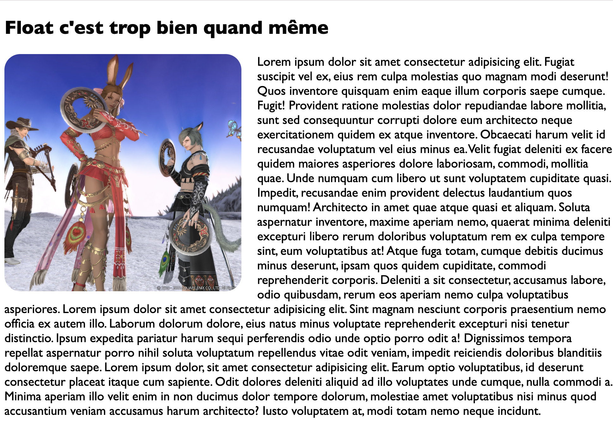
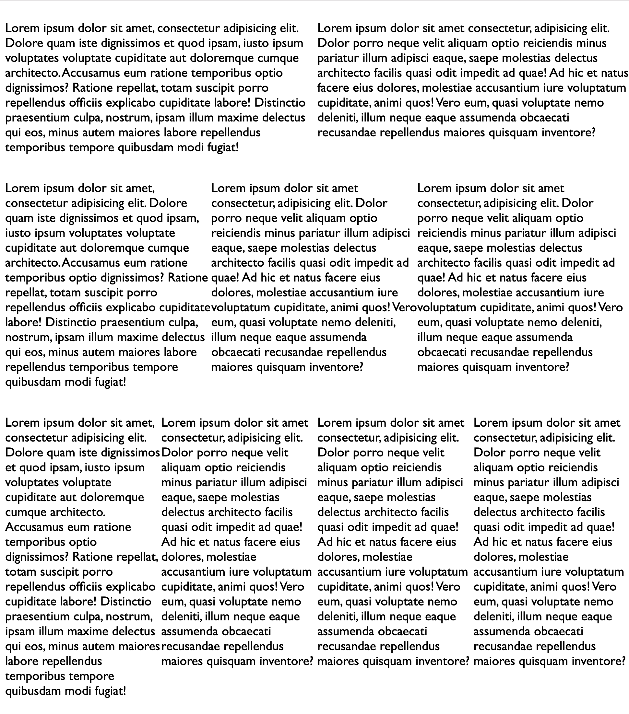
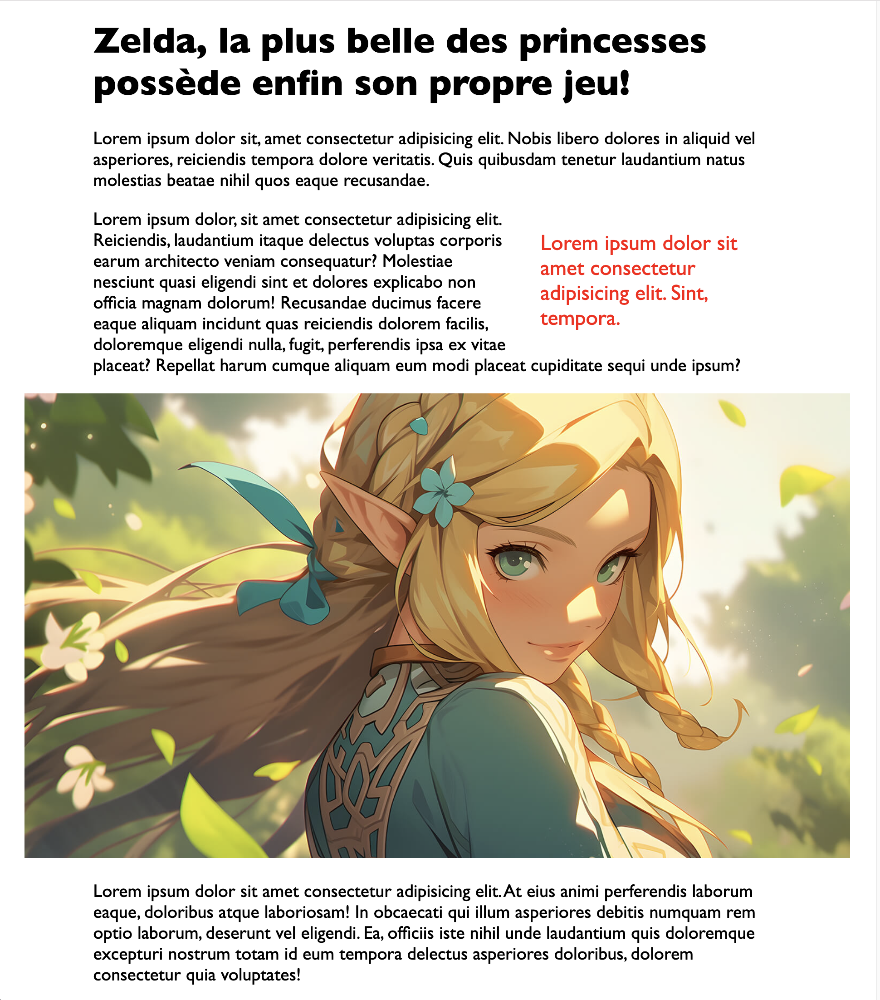

<!-- omit in toc -->
# Exercices CSS

Voyons un peu ensemble si tu as bien compris comment faire du CSS :)

<!-- omit in toc -->
## :memo: Objectifs

- Réaliser tes premières pages de style CSS
- Suivre des consignes précises
- Apprendre les bases du CSS
- Apprendre à se débrouiller en allant lire la théorie vue ou la documentation

<!-- omit in toc -->
## :white_check_mark: Evaluations

- Respect des consignes
- La syntaxe est correcte
- L'indentation est correcte

<!-- omit in toc -->
## Légende des difficultés

Facile: 😄
Modéré: 😊
Exigeant: 😅
Épineux: 😰
Impossible?: 😡

<!-- omit in toc -->
## Liste des exercices

- [😊 CSS Diner (obligatoire)](#-css-diner-obligatoire)
- [😊 CSS Sélecteurs](#-css-sélecteurs)
- [😊 W3 School (obligatoire)](#-w3-school-obligatoire)
- [😄 Ta première page HTML gagne un niveau (obligatoire)](#-ta-première-page-html-gagne-un-niveau-obligatoire)
- [😊 Ta recette gagne un niveau (obligatoire)](#-ta-recette-gagne-un-niveau-obligatoire)
- [😊 Codingame (obligatoire)](#-codingame-obligatoire)
- [😅 Float par ici, float par là (obligatoire)](#-float-par-ici-float-par-là-obligatoire)
- [😰 CSS Zen Garden (optionnel)](#-css-zen-garden-optionnel)
- [😰 CV (optionnel)](#-cv-optionnel)

## 😊 CSS Diner (obligatoire)

>Sujets: css, sélecteurs

Essaye de compléter les niveaux jusqu'au 14.
[http://flukeout.github.io/](http://flukeout.github.io/)

Tu peux allez plus loin mais on a pas encore vu la théorie, ça arrive ne te tracasse pas.

## 😊 CSS Sélecteurs

>Sujets: css, sélecteurs, html

Voici un petit exercice pour essayé de comprendre les sélecteurs CSS dans un environnement plus proche de la réalité qu'avec CSS Diner.

1. Télécharge l'archive .zip [🗜️ ici](https://github.com/sirius-school/assets/blob/main/html-css/css-selector/selectors.zip)
2. Extrais le contenu dans un dossier de ton choix
3. Ouvre le dossier dans VSCode
4. Ouvre le fichier `index.html` dans ton navigateur grâce à l'extension Live Server
5. Lis les instructions sur la page et choisis un exercice

> ❗ Tu ne dois en aucun cas modifié le fichier HTML ou ajouter des propriétés CSS. Tu dois seulement ajouter les sélecteurs CSS dans le fichier CSS pour que les exercices fonctionnent.

## 😊 W3 School (obligatoire)

>Sujets: html, css, sélecteurs, propriété

Réalise [les exercices sur la W3 School](https://www.w3schools.com/css/exercise.asp).

Sujets déjà abordés (correspondant aux sections des exercices sur W3School):

- Selector
- How To...
- Background
- Border
- Margin
- Padding
- Height/Width
- Box Model
- Text
- Font
- Positioning
- Z-Index
- Align
- Backgrounds
- Colors

## 😄 Ta première page HTML gagne un niveau (obligatoire)

>Sujets: html, css, sélecteurs, propriété

Reprend ta page HTML réalisé dans [l'exercices intermédiaire HTML](03-exercices-intermediaires-html.md) et sélectionne les balises que tu as utilisés et laisse ta créativité parler. Ajoute des couleurs, change la taille du texte, ajoute un fond de couleur à la page et aux éléments,... Bref c'est le moment de faire n'importe quoi et de t'amuser avec le CSS.

## 😊 Ta recette gagne un niveau (obligatoire)

>Sujets: html, css, sélecteurs, propriété

Maintenant que tu as vu quelques propriétés CSS, il est temps d'améliorer ta structure HTML de recette réalisé dans [l'exercice recette](04-exercice-recette.md)!

Pas de consigne précise, mets quelques propriétés pour changer la couleur du texte de tes titres et paragraphes. Change la couleur de ton fond. Arrondis les coins de ton image. Bref, lâche toi !

## 😊 Codingame (obligatoire)

>Sujets: css, sélecteurs, propriété

Réalise [les exercices sur Codingame](https://www.codingame.com/playgrounds/36092/exercices-css/introduction)

> ❗ On a pas encore vu la matière pour résoudre le chapitre 4. Tu peux essayer si tu veux ceci dit! 

## 😅 Float par ici, float par là (obligatoire)

>Sujets: html, css, sélecteurs, propriété, float

Voici quelques petites exercices pour apprendre à utiliser un peu plus la propriété `float`.

<!-- omit in toc -->
### Images

Tout d'abord voyons ensemble comment placer une image avec float.

1. Crée une nouvelle page html avec son squelette.
2. Place une image à l'intérieur d'une balise `<main>`
3. Assure toi que l'image ne prennent pas trop de place. Pour ce faire, sélectionne là en CSS et choisis une taille pour en faire une image carré et sans la déformer.
4. Place à la suite de l'image un paragraphe puis du texte avec la commande Emmet suivante: `lorem*10`
5. On veut que notre paragraphe coule le long de l'image à sa droite. Place la propriété `float` avec la bonne valeur. C'est l'image qui doit sortir du flux!
6. Rajoute une petite marge à l'image pour que le texte ne soit pas collé.

Voici le résultat que tu devrais avoir:

<!-- omit in toc -->
### Colones

Nous allons créer ensemble un système de colones avec float. Ce n'est pas la méthode la plus optimale mais ça permet de se familiariser un peu plus avec `float`.

1. Crée une `div` avec la classe `row`. A l'intérieur place 2 `div` avec la classe `col50`.
2. En CSS, sélectionne la classe `col50` et donne lui une **taille de 50%** ainsi que la propriété `float` adéquate.
3. Toujours en CSS, ajoute la propriété `clear:both;` à la classe `row` pour qu'on soit sûr qu'il n'y ai jamais de problème avec les différentes rangés et le float.
4. Répète l'étape 1 et 2 en ajoutant une classe **col33** et **col25**
5. **BONUS**: Tu peux rajouter des margins pour que le texte ne soit pas trop collés. Dans ce cas tu devras utiliser la fonction **calc()** pour t'assurer que les margins soient prisent en compte lors du calcul de la taille.

Voici le résultat que tu devrais avoir:

<!-- omit in toc -->
### Mise en page complexe

1. Crée une balise `main`, ajoute un titre de niveau 1 à l'intérieur puis un paragraphe avec un petit `lorem`.
2. Crée une nouvelle `div` avec la classe `float-right` et mets-y un paragraphe avec un `lorem10`.
3. Toujours à la suite remet un paragraphe avec un `lorem*2`
4. Puis il nous faut une image qui va prendre va être un peu spéciale, elle doit prendre plus de la place que la colone de texte, donc choisit une belle image bien grande. On va ajuster tout ça en CSS juste après.
5. Pour en finir avec l'html, rajoute encore un petit paragraphe avec `lorem*2`
6. Maintenant on s'attaque au CSS. Sélectionne `main` et donne lui une **largeur de 80%** et **centre** le sur ta page.
7. Pour `float-right` rien de bien compliqué. Donne lui une taille en % de 30-35 (à tester), change la couleur du texte et sa taille. Puis place l'élément en `float: right;`. 
8. Pour l'image, il va falloir lui donner une largeur supérieur à 100% (qui doit être égale à 80% du viewport, vu que c'est un enfant de main). Ensuite décale l'image à l'aide d'une `margin-left` négative. Pense que cette margin doit faire la moitié du surplus de pourcentage pour qu'elle soit centrée...
9. **BONUS**: n'hésite pas à expérimenter avec la mise en page, change les couleurs, les tailles, rajoute du contenu si tu veux. 

Voici le résultat que tu devrais avoir:

## 😰 CSS Zen Garden (optionnel)

>Sujets: html, css, sélecteurs, propriété

1. Télécharge le fichier HTML et CSS sur la page principale de [CSS Zen Garden](http://www.csszengarden.com/) ou [📁 sur ce repo](https://github.com/sirius-school/assets/tree/main/html-css/css-zen-garden).
2. Ouvre les fichiers et jette un coup d'oeil.
3. Créer une nouvelle feuille de style et inspire toi de la leur pour créer ton propre style CSS pour CSS Zen Garden. Tu peux évidement copier-coller du CSS de la page originale pour avoir plus facile.
4. Laisse allez ton imagination, essaye des propriétés, fais des recherches sur le net, va voir des exemples.

## 😰 CV (optionnel)

>Sujets: html, css, sélecteurs, propriété

1. Va sur [Canva](http://www.canva.com) et inscris-toi si ce n'est pas déjà le cas.
2. Cherche un modèle de CV qui te semble réalisable en HTML/CSS
3. Remplis le avec tes informations
4. Télécharge le en PDF/JPG
5. Réalise-le en HTML/CSS. Tu auras sans doute besoin de nouvelles propriétés, alors n'hésite pas à allez faire un tour sur la documentation ou d'autres cours comme celui de [W3 School](https://www.w3schools.com/css/default.asp). Tu peux par exemple jeter un oeil à Flexbox ou même CSS Grid, même si nous verrons ces matières ensemble par après..

[:rewind: Retour au sommaire du cours](./README.md#table-des-matières)
