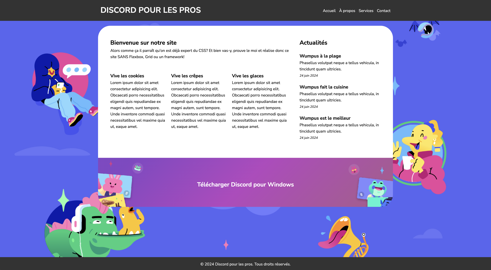

# Maquette Discord Variante (optionnel)

Alors comme ça il parait que la maquette précédente était trop simple? Pas de soucis, je voulais pas te faire peur tout de suite. Voici une nouvelle version un peu plus complexe. Tu ne peux utiliser que des propriétés qu'on a déjà vues! Pas de Flexbox, de Grid ou de framework!!

## :memo: Objectifs

- Réaliser une page de style CSS
- Suivre des consignes précises et plus complexes
- Appliquer un style CSS en respectant une maquette donné
- Apprendre à se débrouiller en allant lire la théorie vue ou la documentation

## :white_check_mark: Evaluations

- Respect des consignes
- La syntaxe est correcte
- L'indentation est correcte

## Mise en place

1. Crée un nouveau repository public nommé "Maquette Discord Variante" sur ton compte Github et fais en sorte que ton travail y soit push!
2. Copie et colle le code HTML fournit plus bas dans un nouveau fichier HTML. (Si t'es vraiment chaud, tu peux essayer de faire le code HTML toi même)
3. Crée une nouvelle feuille de style et lie-la à ton fichier HTML.
4. Affiche la page dans ton navigateur (avec Live Server) pour voir le résultat. Tous les éléments sont là mais rien n'est mis en place.
5. Regarde le screenshot plus bas et tente de reproduire le même style.
6. Je te fournis plus bas le code HTML, les couleurs utilisées et quelques indications de taille. Mais plus de sélecteur! Va falloir analyser la page HTML et te débrouiller pour sélectionner les éléments correctement.
7. Souviens-toi, utilise l'inspecteur d'élément pour tester des valeurs directement dans ton navigateur.
8. N'hésite pas à retourner voir la théorie et la documentation en cas de besoin.
9. Essaye d'allez le plus loin possible sans demander de l'aide.
10. Quand tu as finis, envoie moi le lien vers ton repository
11. Bon courage!

## Screenshot


> :bulb: je t'ai mis un petit gif pour que tu vois un peu comment se comporte le site. Pas besoin qu'il soit responsive, mais il faut tout de même qu'il reste un peu flexible. Ne mets pas des dimensions fixes partout!



## HTML

```html
<!DOCTYPE html>
<html lang="fr">
<head>
  <meta charset="UTF-8">
  <meta name="viewport" content="width=device-width, initial-scale=1.0">
  <title>Page Exemple</title>
  <!-- Insère ton style CSS ici -->
</head>
<body>
  <header>
    <div class="container">
      <h1>Discord pour les pros</h1>
      <nav>
        <ul>
          <li><a href="#">Accueil</a></li>
          <li><a href="#">À propos</a></li>
          <li><a href="#">Services</a></li>
          <li><a href="#">Contact</a></li>
        </ul>
      </nav>
    </div>
  </header>
  <main>
    <div class="container">
      <article>
        <h2>Bienvenue sur notre site</h2>
        <p>Alors comme ça il parraît qu'on est déjà expert du CSS? Et bien vas-y, prouve le moi et réalise donc ce site SANS Flexbox, Grid ou un framework!</p>
        <div class="inside">
          <div class="card">
            <h3>Vive les cookies</h3>
            <p>Lorem ipsum dolor sit amet consectetur adipisicing elit. Obcaecati porro necessitatibus eligendi quis repudiandae ex magni autem, sunt tempore. Unde inventore commodi quasi necessitatibus vel maxime quia ut, eaque amet.</p>
          </div>
          <div class="card">
            <h3>Vive les crêpes</h3>
            <p>Lorem ipsum dolor sit amet consectetur adipisicing elit. Obcaecati porro necessitatibus eligendi quis repudiandae ex magni autem, sunt tempore. Unde inventore commodi quasi necessitatibus vel maxime quia ut, eaque amet.</p>
          </div>
          <div class="card">
            <h3>Vive les glaces</h3>
            <p>Lorem ipsum dolor sit amet consectetur adipisicing elit. Obcaecati porro necessitatibus eligendi quis repudiandae ex magni autem, sunt tempore. Unde inventore commodi quasi necessitatibus vel maxime quia ut, eaque amet.</p>
          </div>
        </div>
      </article>
      <aside>
        <h2>Actualités</h2>
        <div class="news">
          <h3>Wumpus à la plage</h3>
          <p>Phasellus volutpat neque a tellus vehicula, in tincidunt quam ultricies.</p>
          <span class="date">24 juin 2024</span>
        </div>
        <div class="news">
          <h3>Wumpus fait la cuisine</h3>
          <p>Phasellus volutpat neque a tellus vehicula, in tincidunt quam ultricies.</p>
          <span class="date">24 juin 2024</span>
        </div>
        <div class="news">
          <h3>Wumpus est le meilleur</h3>
          <p>Phasellus volutpat neque a tellus vehicula, in tincidunt quam ultricies.</p>
          <span class="date">24 juin 2024</span>
        </div>
      </aside>
    </div>
    <div class="hero">
      <h3>Télécharger Discord pour Windows</h3>
    </div>
  </main>
  <footer>
    <div class="container">
      <p>&copy; 2024 Discord pour les pros. Tous droits réservés.</p>
    </div>
  </footer>
</body>
</html>
```

## Ressources

Tu peux télécharger les images ici: [📁 Assets](https://github.com/sirius-school/assets/tree/main/html-css/discord-variante)

## Astuce

- Va falloir utiliser des floats pour placer tes éléments. De nos jours ont ne fait plus un site comme ça. On utilisera Flexbox ou Grid pour créer nos mises en page. Cependant c'est toujours un bon exercice pour apprendre à utiliser float et voir à quel point c'est pas évident de faire des mises en page complexes sans ces outils.
- Je te donne un sélecteur et une propriété que tu auras besoin normalement. C'est une propriété qu'on a pas encore vue, mais sans elle pas moyen d'afficher le fond de `main` correctement. N'hésite pas à tester sans pour voir le résultat.

```css
main .container {
  overflow: hidden;
  /* Insère le reste des propriétés dont tu as besoin ici */
}
```

- Ici la difficulté n'est pas dans le style mais bien dans l'agencement des différentes `div`. Procède étape par étape. Commence par des choses simples, essaye des bouts de code et corrige au fur et à mesure.

## Couleurs

- le fond du header et footer: #333333
- le texte du header et footer: #ffffff
- le dégradé du `hero`: `135deg, #8547c6 10%, #b845c1 50%, #ab5d8a` :bulb: ceci s'appel un linear gradient. On a pas vu la théorie dessus, mais à toi de faire une petite recherche Google.

## Font

- La police d'écriture pour toute la maquette est **Nunito Sans"**. Cherche sur [Google Font](http://fonts.google.com) ou reprend le code plus bas.

```css
@import url('https://fonts.googleapis.com/css2?family=Nunito+Sans:ital,opsz,wght@0,6..12,200..1000;1,6..12,200..1000&display=swap');

font-family: "Nunito Sans", sans-serif;
```

## Tailles

- le container principal fait 90% de largeur et maximum 1200px.
- le header fait 85px de haut
- la balise `<main>` fait 90% de largeur
- article fait 70% de largeur et aside fait 30%
- inside doit faire 33% car tu as 3 colones, mais il va falloir calculer des marges pour que les colonnes ne soient pas l'une contre l'autre.
- la balise avec la classe `hero` à une hauteur de 200px et une largeur de 90% et 1200px de largeur max.`
- le footer fait 100% de largeur

## Positions

- Il faut centrer `main` grâce aux **margins**.
- Le footer doit être positionné de manière **fixe** en bas de page.

## CSS

N'oublie pas, ceci sont les sélecteurs que j'ai utilisé mais tu peux sans problème tenter de réaliser l'exercice sans en prendre compte et choisir tes propres sélecteurs si tu te sens à l'aise. Il n'y a pas de bonne ou mauvaise utilisation des sélecteurs, juste une façon optimale de le faire.

```css
body{
  /* insère ton style ici */
}

/* Reset CSS */
* {
  margin: 0;
  padding: 0;
  box-sizing: border-box;
}

/* Body and Container */
body {
  /* insère ton style ici */
}

.container {
  /* insère ton style ici */
}

/* Header */
header {
  /* insère ton style ici */
}

header h1 {
  /* insère ton style ici */
}

nav {
  /* insère ton style ici */
}

nav ul {
  /* insère ton style ici */
}

nav ul li {
  /* insère ton style ici */
}

nav ul li a {
  /* insère ton style ici */
}

/* Main Content */
main {
  /* insère ton style ici */
}


main .container {
  /* insère ton style ici */
}

article {
  /* insère ton style ici */
}

.inside {
  /* insère ton style ici */
}

.inside .card{
  /* insère ton style ici */
}

aside {
  /* insère ton style ici */
}

aside .news{
  /* insère ton style ici */
}

.news .date {
  /* insère ton style ici */
}

.hero {
  /* insère ton style ici */
}

.hero h3 {
  /* insère ton style ici */
}

/* Footer */
footer {
  /* insère ton style ici */
}

```

[:rewind: Retour au sommaire du cours](./README.md#table-des-matières)
