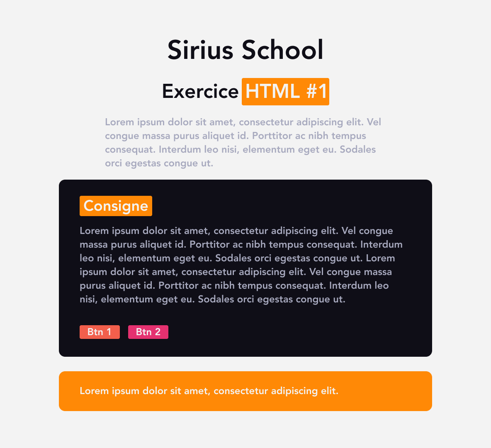
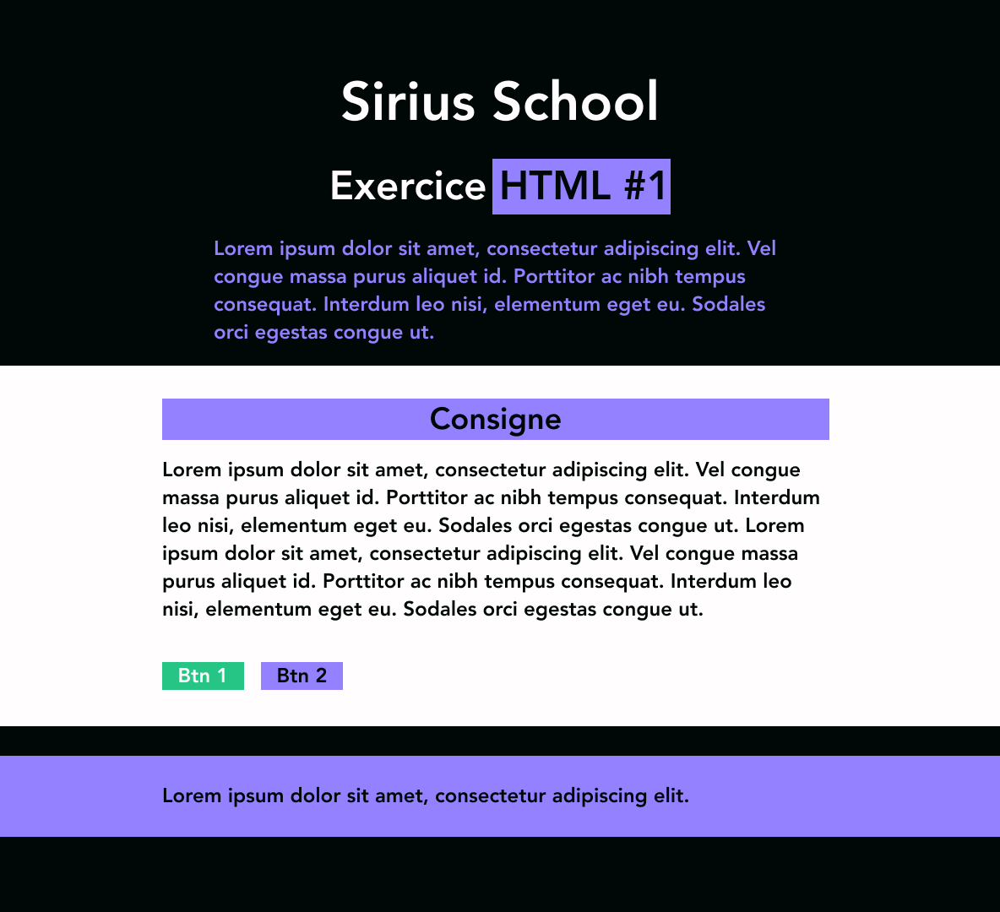

# Exercice variation style CSS

Le but de cet exercice est de créer une structure HTML et de ne plus y toucher par après mais de proposer des variantes grâce au CSS. Utilise tout ce que tu as appris jusqu'ici: les sélecteurs, les pseudo-sélecteurs, les propriétés,...

## :memo: Objectifs

- Réaliser une maquette à partir de rien
- Suivre des consignes précises
- Trouver des styles CSS qui fonctionne bien au niveau des couleurs
- Apprendre à se débrouiller en allant lire la théorie vue ou la documentation

## :white_check_mark: Evaluations

- Respect des consignes
- La syntaxe est correcte
- L'indentation est correcte

## Mise en place

1. Crée un nouveau dossier `exercices-variations` et un fichier html `index.html`.
2. Essaye de créer la structure HTML en te basant sur les screenshots plus bas.
3. Ajoute un fichier CSS `variant01.css`. Ajoute du style à ta page, laisse libre cours à ton imagination et ta créativité.
4. Utilise [Coolors](https://coolors.co/), [FlatUi](https://flatuicolors.com/) ou [Adobe Color](https://color.adobe.com/fr/create/color-wheel) pour choisir des couleurs qui vont bien ensemble.
5. Change également la taille des éléments. Utilise des fonts différentes, change la font-weight des titres, ajoute du padding,...
6. Réalise **2 variations CSS minimum** du même fichier HTML.

## Screenshot

> :exclamation: **Ces screenshots sont des exemples.** Tu peux reproduire le contenu à l'identique, mais n'hésite pas à changer les tailles, les positions et les couleurs! 

[:rewind: Retour au sommaire du cours](README.md#table-des-matières)
