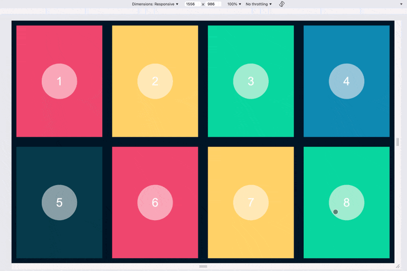
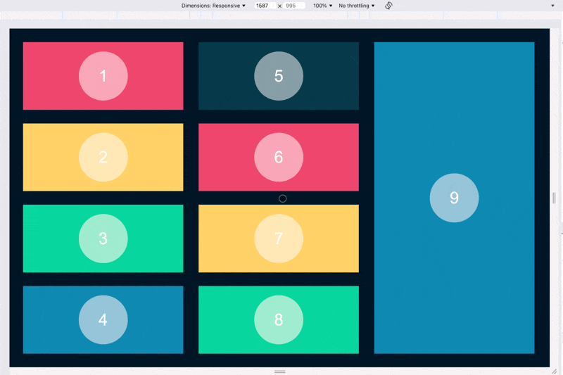
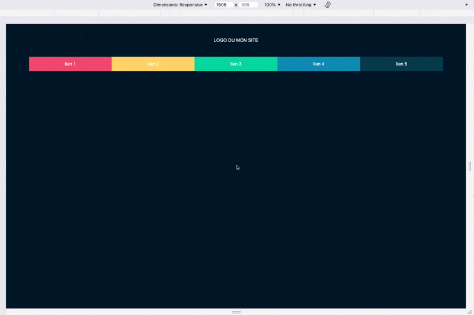

<!-- omit in toc -->
# Exercices Flexbox

<!-- omit in toc -->
## :memo: Objectifs

- Comprendre et retenir les principes de Flexbox
- Suivre des consignes précises
- Apprendre à se débrouiller en allant lire la théorie vue ou la documentation

<!-- omit in toc -->
## :white_check_mark: Evaluations

- Respect des consignes
- La syntaxe est correcte
- L'indentation est correcte

<!-- omit in toc -->
## Légende des difficultés

Facile: 😄
Modéré: 😊
Exigeant: 😅
Épineux: 😰
Impossible?: 😡

<!-- omit in toc -->
## Table des matières

- [😄 \> 😅 Flexbox Froggy (obligatoire!)](#---flexbox-froggy-obligatoire)
- [😄 \> 😅 Flexbox Zombies (optionnel)](#---flexbox-zombies-optionnel)
- [😄 \> 😰 Flexbox Tower Defense (optionnel)](#---flexbox-tower-defense-optionnel)
- [😊 Maquette Discord (optionnel)](#-maquette-discord-optionnel)
- [Exercices](#exercices)
  - [😄 Exercice 1](#-exercice-1)
  - [😊 Exercice 2](#-exercice-2)
  - [😅 Exercice 3](#-exercice-3)

## 😄 > 😅 Flexbox Froggy (obligatoire!)

[](https://flexboxfroggy.com/#fr)

Essaie de compléter tous les exercices sur ce petit jeu, cela t'aidera à encore mieux visualiser les différentes propriétés liées à Flexbox. Le but est de placer les grenouilles de couleur sur les nénuphars de la même couleur.

## 😄 > 😅 Flexbox Zombies (optionnel)

Voici encore un jeu que tu peux compléter. Cette fois-ci ce ne sont pas des grenouilles mais des zombies qu'il va falloir aligner pour les dégomer!

[Flexbox Zombies](https://mastery.games/flexboxzombies/)

## 😄 > 😰 Flexbox Tower Defense (optionnel)

Et tu n'en as pas encore assez de Flexbox? Et bien tiens, voici encore un p'tit jeu dans la même veine que Froggy. Cette fois le but c'est d'apprendre à positionner tes éléments, ici des tours, pour supprimer les ennemis quand ils passent devant les tours. Ils doivent tous être supprimé avant d'arriver à la fin du parcours!

[Flexbox Defense](http://www.flexboxdefense.com/)

## 😊 Maquette Discord (optionnel)

[Reprends la maquette "Discord" qu'on a fait plus tôt](11-exercice-css-maquette-discord.md) et essaye de changer le header, la nav et les sections en `display:flex`.

## Exercices

### 😄 Exercice 1

Reproduis la mise en page suivante. Il faut 4 `<div>` par rangé, il y a donc 2 rangés. Le tout doit resté `flexible`. Ne te fie pas aux tailles que tu vois sur le screenshot.



Pour ce faire tu auras besoin du code HTML et CSS suivant:

```html
<!DOCTYPE html>
<html lang="en">
<head>
  <meta charset="UTF-8">
  <meta name="viewport" content="width=device-width, initial-scale=1.0">
  <link rel="stylesheet" href="./style.css">
  <title>Flexbox #01</title>
</head>
<body>
  <section>
    <div><span>1</span></div>
    <div><span>2</span></div>
    <div><span>3</span></div>
    <div><span>4</span></div>
    <div><span>5</span></div>
    <div><span>6</span></div>
    <div><span>7</span></div>
    <div><span>8</span></div>
  </section>
</body>
</html>
```

```css
/* SETUP CSS - Ne rien modifier ici */
body {
  background-color: #011627;
  color: #fdfffc;
  font-family: Arial, Helvetica, sans-serif;
  text-align: center;
  margin: 0;
  padding: 0; 
  border: 0;
}

div { background-color: #073b4c; }
div:nth-of-type(5n+1) { background-color: #ef476f; }
div:nth-of-type(5n+2) { background-color: #ffd166; }
div:nth-of-type(5n+3) { background-color: #06d6a0; }
div:nth-of-type(5n+4) { background-color: #118ab2; }

span { background-color: rgba(255, 255, 255, .5); border-radius: 50%; display: block; font-size: 48px; height: auto; line-height: 3em; text-align: center; width: 3em; }
/* CSS SETUP END */


/* Ajoute et modifie ici */
section{
  display:block;
}
```

### 😊 Exercice 2

Reproduis la mise en page suivante. Attention au sens des `<div>`, ce n'est plus de gauche à droite mais de haut en bas. On a donc 3 colonnes. Le tout doit resté `flexible`. Ne te fie pas aux tailles que tu vois sur le screenshot.



Reprends le code HTML plus haut, rajoute cette `<div>` et trouve comment faire en sorte qu'elle soit différente comme sur le screenshot.

```html
    <div><span>9</span></div>
```

### 😅 Exercice 3

Reproduis la mise en page suivante. Le tout doit resté `flexible`. Ne te fie pas aux tailles que tu vois sur le screenshot.



Utilise l'HTML et CSS suivant.

```html
<!DOCTYPE html>
<html lang="en">
<head>
  <meta charset="UTF-8">
  <meta name="viewport" content="width=device-width, initial-scale=1.0">
  <link rel="stylesheet" href="./style.css">
  <title>Flexbox #03</title>
</head>
<body>
  <header>LOGO DU MON SITE</header>
    <nav>
      <ul>
        <li><a href="#">lien 1</a></li>
        <li><a href="#">lien 2</a></li>
        <li><a href="#">lien 3</a></li>
        <li><a href="#">lien 4</a></li>
        <li><a href="#">lien 5</a></li>
      </ul>
    </nav>
</body>
</html>
```

```css
/* SETUP CSS - Ne rien modifier ici */
body {
  background-color: #011627;
  color: #fdfffc;
  font-family: Arial, Helvetica, sans-serif;
  text-align: center;
  margin: 0;
  padding: 0; 
  border: 0;
}

ul { list-style: none; padding: 0; margin: 0; height: 100px; }
li { background-color: #073b4c; text-align: center; }
li:nth-of-type(5n+1) { background-color: #ef476f; }
li:nth-of-type(5n+2) { background-color: #ffd166; }
li:nth-of-type(5n+3) { background-color: #06d6a0; }
li:nth-of-type(5n+4) { background-color: #118ab2; }
a { color: white; font-size: 16px; line-height: 50px; text-decoration: none; }
/* CSS SETUP END */

/* Ajoute et modifie ici */
```

[:rewind: Retour au sommaire du cours](./README.md#table-des-matières)
