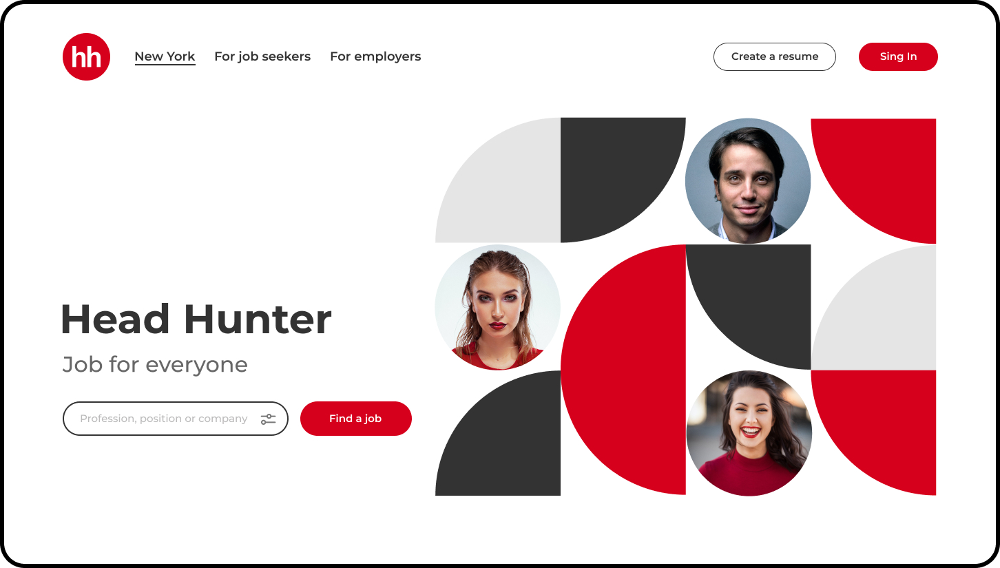

# Maquette Head Hunter

Voici une autre maquette assez identique à la précédente en terme de mise en page. Il y a juste un petit casse-tête sympa avec Flexbox et l'illustration à droite.

## :memo: Objectifs

- Réaliser une maquette sans HTML et CSS de base.
- Suivre des consignes précises.
- Apprendre à se débrouiller en allant lire la théorie vue ou la documentation.

## :white_check_mark: Evaluations

- Respect des consignes.
- La syntaxe est correcte.
- L'indentation est correcte.

## Consignes

- Sois le plus fidèle possible au modèle
- Il n'y a qu'une seule page, mais elle doit être parfaite!

## Screenshot



## Les ressources

Tu peux retrouver les images nécessaires à la réalisation de cet exercice par ici: [📁 Assets](https://github.com/sirius-school/assets/tree/main/html-css/head-hunter)

## Les couleurs

- Le fond de la page: #E5E5E5
- Le rouge des formes: #D6001C
- Le gris foncé des formes: #333333
- Le gris clair des formes: #E5E5E5
- Le gris foncé du texte: #333333
- Le gris clair du texte: #676767

## La Google font

```css
@import url('https://fonts.googleapis.com/css2?family=Montserrat:wght@500;600;700&display=swap');

font-family: 'Montserrat', sans-serif;
```

## L'illustration de droite

Pour cette illustration, :exclamation: interdit de faire un :camera: screenshot!

Il va falloir utiliser toutes tes compétences en CSS et en Flex pour y arriver !

Il y a pleins de possibilités d'y arriver, expérimente et fais en sorte que ça soit "responsive", il ne faut pas que l'ensemble se déforme si la page est plus grande ou plus petite.

