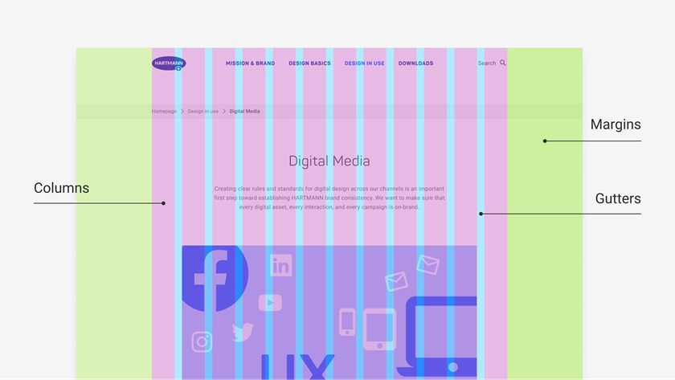
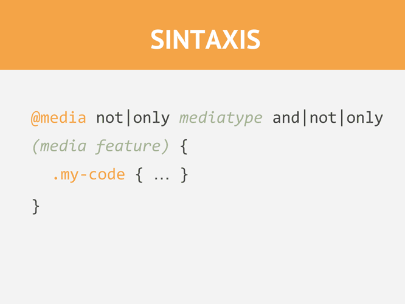
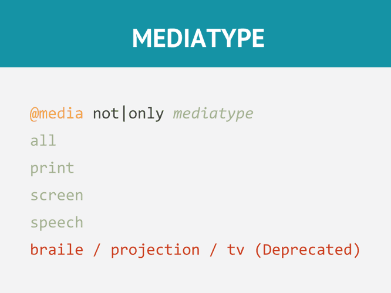

<!-- omit in toc -->
# Responsive Design

Voyons ensemble comment rendre nos pages accessibles sur toutes les tailles d'écran.

<!-- omit in toc -->
## Table des matières

- [Qu'est-ce que c'est que le responsive design](#quest-ce-que-cest-que-le-responsive-design)
- [Viewport](#viewport)
  - [Comment est configurer le viewport](#comment-est-configurer-le-viewport)
  - [Taille du contenu dans le viewport](#taille-du-contenu-dans-le-viewport)
- [Images responsive](#images-responsive)
- [Vue en grille](#vue-en-grille)
- [Media Query](#media-query)
  - [Ajouter un breakpoint](#ajouter-un-breakpoint)
  - [Penser son site en Mobile First](#penser-son-site-en-mobile-first)
  - [Des breakpoints typiques](#des-breakpoints-typiques)
  - [Orientation: Portrait / Landscape](#orientation-portrait--landscape)
  - [Cacher des éléments](#cacher-des-éléments)
  - [Changer le taille d'une police](#changer-le-taille-dune-police)
  - [Tester ses media queries](#tester-ses-media-queries)
- [11 Bonnes pratiques en Responsive Design](#11-bonnes-pratiques-en-responsive-design)
  - [1. Pensez petit... et grand](#1-pensez-petit-et-grand)
  - [2. Pensez au contexte](#2-pensez-au-contexte)
  - [3. Réduire intelligemment le contenu](#3-réduire-intelligemment-le-contenu)
  - [4. Priorisez le contenu différemment](#4-priorisez-le-contenu-différemment)
  - [5. Navigation évolutive](#5-navigation-évolutive)
  - [6. La qualité des images VS vitesse de téléchargement](#6-la-qualité-des-images-vs-vitesse-de-téléchargement)
  - [7. Utiliser des icônes](#7-utiliser-des-icônes)
  - [8. Faites attention à la taille de vos polices](#8-faites-attention-à-la-taille-de-vos-polices)
  - [9. Pensez aux méthodes de saisie](#9-pensez-aux-méthodes-de-saisie)
  - [10. Testez votre design sur des appareils actuels](#10-testez-votre-design-sur-des-appareils-actuels)
  - [11. Inspirez-vous, codez et testez!](#11-inspirez-vous-codez-et-testez)
  - [Source](#source)
- [En savoir plus](#en-savoir-plus)

## Qu'est-ce que c'est que le responsive design


Le Responsive Design, c'est l'art de perfectionner l'ergonomie de votre interface pour garantir une expérience optimale sur une variété d'appareils, qu'il s'agisse de smartphones, de tablettes, d'ordinateurs, et bien plus encore.

L'approche du Responsive Design repose principalement sur l'utilisation de langages fondamentaux tels que HTML et CSS, sans recourir à des scripts complexes ou à des logiciels dédiés. Cependant, il est possible d'exploiter des bibliothèques spécifiques telles que Tailwind, Bootstrap, Foundation, ou Skeleton, pour faciliter le processus de mise en page et d'adaptation.

L'objectif majeur du Responsive Design est de maintenir l'intégrité du contenu sur tous les dispositifs, en évitant de le supprimer arbitrairement pour s'adapter à des résolutions d'écran plus petites. Plutôt que de supprimer du contenu, on privilégie la possibilité de masquer certains éléments non essentiels, tels que des illustrations, afin de libérer de l'espace pour les informations essentielles.

Pour accomplir cela, le Responsive Design tire parti du pouvoir du CSS, permettant de redimensionner, déplacer, masquer, agrandir ou réduire les éléments de manière harmonieuse et fluide.

[:arrow_up: Revenir au top](#table-des-matières)

## Viewport


Le viewport représente la portion visible d'une page web lorsqu'elle est affichée à l'utilisateur. Sa dimension varie en fonction de l'appareil utilisé, étant généralement plus restreinte sur un smartphone que sur un écran d'ordinateur.

Auparavant, avant l'avènement des tablettes et des smartphones, les concepteurs de sites web se limitaient souvent à créer des pages web avec une taille fixe, principalement adaptée aux écrans d'ordinateur. Lorsque les tablettes et les téléphones mobiles ont fait leur entrée, la solution initiale consistait à réduire simplement la taille de la page pour qu'elle s'affiche sur ces nouveaux appareils. Bien que cette méthode fonctionnait dans une certaine mesure, elle ne garantissait pas toujours une lisibilité optimale et forçait l'utilisateur à zoomer sur les sections du site qui l'intéressait.

Le Responsive Design, quant à lui, vise à résoudre ce problème en adoptant une approche plus sophistiquée pour adapter la mise en page et les éléments de la page en fonction de la taille du viewport. Cette approche permet une expérience utilisateur plus fluide et agréable, en optimisant la lisibilité et la convivialité sur une gamme variée d'appareils, des ordinateurs de bureau aux smartphones.


> Crédit: [Webadev](https://www.webadev.com/)

[:arrow_up: Revenir au top](#table-des-matières)

### Comment est configurer le viewport

Depuis l'introduction d'HTML5, il est possible d'inclure une balise `<meta>` dans le code HTML pour exercer un contrôle sur le viewport, c'est-à-dire la fenêtre visible de la page web lorsqu'elle est affichée sur un navigateur. Cette balise est probablement familière, car vous l'avez peut-être déjà rencontrée dans des exemples de code :

```html
<meta name="viewport" content="width=device-width, initial-scale=1.0">
```

Cette balise est utilisée dans le code HTML pour contrôler la manière dont la page web est affichée sur les différents appareils, en particulier lorsqu'il s'agit de créer une expérience de navigation adaptative (Responsive Design) pour les dispositifs mobiles. Voici ce que chaque partie de cette balise signifie :

- `name="viewport"` : Cette partie de la balise indique au navigateur que nous définissons des paramètres de vue (viewport) pour la page web. En d'autres termes, elle spécifie que nous voulons contrôler la manière dont la page est affichée à l'utilisateur en fonction de la taille de l'écran de l'appareil.

- `content="width=device-width, initial-scale=1.0"` : Cette partie de la balise définit les paramètres de vue (viewport) proprement dits. Voici ce que font ces paramètres :

  - `width=device-width` : Cette instruction indique au navigateur de régler la largeur de la page web pour qu'elle corresponde à la largeur réelle de l'écran de l'appareil. Cela signifie que la page s'ajuste automatiquement à la largeur de l'écran de l'appareil, quelle que soit sa taille, ce qui est essentiel pour garantir une mise en page adaptée aux dispositifs mobiles et de bureau.

  - `initial-scale=1.0` : Ce paramètre spécifie le niveau de zoom initial auquel la page web est affichée lorsqu'elle est chargée dans le navigateur. En définissant initial-scale sur 1.0, cela signifie que la page est affichée sans zoom initial, ce qui permet au contenu d'apparaître à sa taille d'origine. Cette option est cruciale pour assurer que le contenu est clair et lisible dès le chargement de la page, quel que soit l'appareil utilisé.

En combinant ces deux paramètres, la balise `<meta>` crée une base solide pour le Responsive Design en garantissant que la page web s'adapte correctement à la taille de l'écran de l'appareil et en offrant une expérience utilisateur cohérente sans zoom excessif lors du chargement initial de la page. Cela permet aux utilisateurs de naviguer facilement sur votre site web, qu'ils utilisent un smartphone, une tablette ou un ordinateur de bureau.

[Exemple de scale](https://www.w3schools.com/css/css_rwd_viewport.asp)

[:arrow_up: Revenir au top](#table-des-matières)

### Taille du contenu dans le viewport

Éviter que les éléments dépassent le viewport, entraînant un défilement horizontal, est une pratique essentielle en conception web pour garantir une expérience utilisateur fluide. Les utilisateurs sont habitués à faire défiler verticalement, donc tout défilement horizontal inattendu peut perturber leur expérience. Cependant, dans certaines situations, un défilement horizontal peut être intentionnellement utilisé pour une conception innovante. Voici une explication plus détaillée :

1. **Éviter le défilement horizontal** : La plupart des utilisateurs sont familiers avec le défilement vertical pour naviguer sur une page web. Introduire un défilement horizontal non prévu peut désorienter les utilisateurs et créer une expérience utilisateur frustrante. Il est donc généralement conseillé de concevoir des pages web de manière à ce qu'elles s'adaptent à la largeur du viewport, sans nécessiter de défilement horizontal.

2. **Défilement horizontal intentionnel** : Il peut y avoir des cas spécifiques où un défilement horizontal est intentionnellement utilisé pour une conception novatrice. Par exemple, dans un site web artistique ou créatif, un défilement horizontal peut être utilisé pour créer une expérience unique. Cependant, cela nécessite une réflexion de conception approfondie et peut exiger du code supplémentaire pour gérer le défilement horizontal de manière élégante.

3. **Contenu flexible** : Plutôt que de concevoir des éléments basés sur une largeur de viewport spécifique, il est généralement recommandé de privilégier un contenu flexible qui peut s'adapter à différentes tailles de viewport. Cela se fait en utilisant des techniques de mise en page responsive, telles que les media queries, qui permettent d'appliquer des styles différents en fonction de la largeur de l'écran. Ainsi, le contenu reste lisible et utilisable sur une variété d'appareils et de tailles d'écran.

4. **Media Queries** : Les media queries sont des outils essentiels en conception web responsive. Elles permettent de définir des règles CSS spécifiques en fonction des caractéristiques du viewport, telles que la largeur de l'écran. Cela signifie que vous pouvez appliquer des styles différents aux éléments en fonction de la taille de l'écran, assurant ainsi une présentation optimale du contenu sur chaque dispositif.

En résumé, il est essentiel de concevoir des sites web de manière à éviter le défilement horizontal non souhaité, en privilégiant un contenu flexible qui s'adapte aux différentes tailles de viewport. Si un défilement horizontal est souhaité pour une conception innovante, il doit être soigneusement réfléchi et mis en œuvre avec soin, et il peut nécessiter un code supplémentaire pour assurer une expérience utilisateur cohérente. Les media queries sont un outil précieux pour créer des designs web responsifs qui s'adaptent harmonieusement à toutes les tailles d'écran.

[:arrow_up: Revenir au top](#table-des-matières)

## Images responsive

Une image responsive est une image qui se redimensionne correctement sur n'importe quelle résolution. Il y a plusieurs possibilités pour faire cela.

- Utiliser la propriété `width` en css et la valeur 100%. Ainsi l'image s'adaptera à son conteneur.
- Utiliser la propriété `max-width` en css et une valeur à ne pas dépasser. Ainsi l'image sera responsive jusqu'à la taille précisée.
- Montrer des images différentes en fonction de la largeur du viewport avec la balise HTML `<picture>`.

```html
<picture>
  <source srcset="img_smallflower.jpg" media="(max-width: 600px)">
  <source srcset="img_flowers.jpg" media="(max-width: 1500px)">
  <source srcset="flowers.jpg">
   <!-- Fallback -->
</picture>
```

`<picture></picture>` est particulièrement utile dans le contexte du Responsive Design et de la gestion des images pour les raisons suivantes :

1. **Images adaptatives** : La balise `<picture>` permet de fournir des images adaptatives, ce qui signifie que différentes versions de l'image peuvent être proposées en fonction de la taille de l'écran de l'utilisateur. Cela garantit que les images sont optimisées pour chaque appareil, ce qui est essentiel pour garantir une expérience utilisateur de qualité.
2. **Optimisation de la performance**: En fournissant des images adaptées à la taille de l'écran, la balise `<picture>` permet de réduire la taille des fichiers image téléchargés, ce qui améliore la performance du site en termes de vitesse de chargement. Cela est particulièrement important pour les utilisateurs sur des connexions Internet plus lentes ou des appareils mobiles.
3. **Qualité d'image optimisée** : La balise `<picture>` permet également de sélectionner la meilleure qualité d'image en fonction de la taille de l'écran. Ainsi, les utilisateurs sur des écrans plus grands bénéficient d'images de haute qualité, tandis que ceux sur des écrans plus petits voient des images de qualité adaptée.
4. **Compatibilité** : La balise `<picture>` est bien prise en charge par les navigateurs modernes, ce qui signifie qu'elle peut être utilisée en toute confiance dans la création de sites web.

Cependant, il est important de noter que son utilisation peut varier en fonction des besoins du projet. Dans certains cas, les développeurs peuvent préférer d'autres méthodes d'optimisation d'images, telles que l'utilisation de formats d'image modernes comme WebP ou l'utilisation de techniques de chargement paresseux (lazy loading) pour améliorer encore la performance. Le choix dépendra des spécificités du projet et des objectifs de conception du site web.

[En savoir plus](https://www.w3schools.com/tags/tag_picture.asp)

[:arrow_up: Revenir au top](#table-des-matières)

## Vue en grille



La vue en grille de 12 colonnes (par exemple) est un système de mise en page très courant en conception web, notamment dans le cadre du Responsive Design. Ce système divise l'espace horizontal d'une page web en 12 colonnes égales. Chaque élément de la page est ensuite positionné en utilisant ces colonnes, ce qui permet de créer une mise en page flexible et réactive qui s'adapte aux différentes tailles d'écran. Voici comment cela fonctionne dans le contexte du Responsive Design :

1. **Flexibilité et Adaptabilité**: L'un des avantages majeurs d'une grille de 12 colonnes est sa flexibilité. En fonction de la taille de ton écran, tu peux décider de combien de ces 12 colonnes un élément spécifique devrait occuper. Par exemple, sur un grand écran d'ordinateur, un élément peut occuper 6 colonnes, tandis que sur un smartphone, il pourrait n'en occuper que 12. Cette adaptabilité permet à ta mise en page de s'ajuster de manière fluide à différentes résolutions d'écran.
2. **Utilisation de Media Queries** : Le Responsive Design utilise généralement des media queries pour définir des points de rupture où la mise en page doit être modifiée en fonction de la taille de ton écran. Lorsque ton écran devient plus petit (par exemple, lorsque tu passes d'un ordinateur de bureau à une tablette ou à un smartphone), tu peux réorganiser les éléments en modifiant le nombre de colonnes qu'ils occupent. Les media queries te permettent de définir ces ajustements spécifiques.
3. **Fluence et Ordre de Lecture**: Une grille de 12 colonnes permet également de gérer l'ordre de lecture du contenu. Par exemple, sur un écran étroit, tu peux décider que certaines colonnes doivent passer en haut de la page pour une meilleure expérience de lecture. Cette réorganisation de l'ordre des éléments peut être réalisée avec des propriétés CSS comme Flexbox ou CSS Grid.
4. **Optimisation de l'Espace** : En utilisant une grille de 12 colonnes, tu peux optimiser l'espace sur ta page en positionnant efficacement les éléments. Cela peut aider à garantir que ta page conserve un aspect propre et organisé, quel que soit l'écran que tu utilises.
5. **Gestion des Images et du Contenu** : Dans le cadre du Responsive Design, il est essentiel de gérer les images et le contenu de manière à ce qu'ils s'adaptent aux différentes tailles d'écran. Une grille de 12 colonnes facilite cette gestion en te permettant de définir des largeurs et des marges appropriées pour les éléments, ainsi que des comportements de réorganisation en fonction de la taille de ton écran.

En résumé, une grille de 12 colonnes est un outil puissant pour créer des mises en page flexibles et adaptatives dans le cadre du Responsive Design. Elle offre une base solide pour organiser et positionner les éléments de la page de manière à ce qu'ils s'ajustent de manière harmonieuse à diverses résolutions d'écran, garantissant ainsi une expérience utilisateur optimale sur une variété d'appareils.

Voici un exemple de grille de 12 colonnes en CSS sans l'aide de Flexbox ou Grid. 

```css
[class*="col-"] {
  float: left;
}

.col-1 {width: 8.33%;}
.col-2 {width: 16.66%;}
.col-3 {width: 25%;}
.col-4 {width: 33.33%;}
.col-5 {width: 41.66%;}
.col-6 {width: 50%;}
.col-7 {width: 58.33%;}
.col-8 {width: 66.66%;}
.col-9 {width: 75%;}
.col-10 {width: 83.33%;}
.col-11 {width: 91.66%;}
.col-12 {width: 100%;}
```

On utilise ces classes pour définir le nombres de colonnes que notre élément doit prendre. Cette technique est notamment utilisé dans Bootstrap. Seulement telle qu'elle c'est responsive, jusqu'à un certain stade, dès que l'on passe sur une résolution fort basse, le tout est écrasé. De nouveau, on va voir les Media Queries un peu plus bas pour remédier à cela.

Ensuite en HTML il faut que l'ensemble des colonnes utilisés dans une rangée s'additionne pour faire 12. C'est mieux.

```html
<div class="row">
  <div class="col-3">...</div> <!-- 25% -->
  <div class="col-9">...</div> <!-- 75% -->
</div>
```

[Voir un exemple](https://www.w3schools.com/css/tryit.asp?filename=tryresponsive_styles)

[:arrow_up: Revenir au top](#table-des-matières)

## Media Query

Les Media Queries sont une technique en CSS3 qui permet de conditionner l'application de certaines règles CSS en fonction de caractéristiques spécifiques du périphérique ou de l'écran sur lequel une page web est affichée.


```css
/* Si la largeur de la fenêtre du navigateur est de 600px ou moins, le fond de body deviendra rouge*/
@media only screen and (max-width: 600px) {
  body {
    background-color: red;
  }
}
```



Les Media Queries permettent de rendre une page web réactive en adaptant son apparence en fonction des caractéristiques de l'appareil ou de la fenêtre du navigateur, ce qui améliore l'expérience utilisateur sur différents écrans et tailles de dispositifs.



:book: [La documentation des MQ](https://www.w3schools.com/cssref/css3_pr_mediaquery.asp)

[:arrow_up: Revenir au top](#table-des-matières)

### Ajouter un breakpoint

Un breakpoint en Media Query est un point de rupture spécifique dans la conception d'un site web ou d'une application où la mise en page et les styles CSS sont modifiés pour s'adapter à différentes tailles d'écran ou à différents dispositifs. Les breakpoints sont utilisés pour définir les points de rupture où la conception réactive (Responsive Design) doit changer pour garantir une expérience utilisateur optimale sur un large éventail d'appareils, tels que des ordinateurs de bureau, des tablettes et des smartphones.

Dans l'exemple vu plus haut, on avait nos classes de nos 12 colonnes, mais si tu as [regardé l'exemple](https://www.w3schools.com/css/tryit.asp?filename=tryresponsive_styles) et essayé de réduire ta fenêtre de navigateur, le site devient peu lisible une fois que le viewport est trop petit.

On va ajouter le code suivant pour régler notre soucis:

```css
@media only screen and (max-width: 768px) {
  /* For mobile phones: */
  [class*="col-"] {
    width: 100%;
  }
}
```

Voici [le résultat](https://www.w3schools.com/css/tryit.asp?filename=tryresponsive_breakpoints)

[:arrow_up: Revenir au top](#table-des-matières)

### Penser son site en Mobile First


Le concept de "Mobile First" en Responsive Design est une approche de conception qui privilégie la création et l'optimisation d'un site web pour les appareils mobiles, tels que les smartphones, avant de s'occuper des versions pour les écrans plus grands. En commençant par concevoir pour les mobiles, on place l'accent sur la simplicité, la performance et l'efficacité, en s'assurant que le site fonctionne bien sur des écrans plus petits. Ensuite, des ajustements progressifs sont apportés pour améliorer l'expérience sur des écrans plus larges, ce qui garantit une expérience utilisateur optimale sur une variété d'appareils, tout en réduisant la complexité et la charge des ressources pour les utilisateurs mobiles. Cette approche favorise la réactivité et la fluidité de la conception, en accordant la priorité à la base essentielle avant d'ajouter des fonctionnalités pour les écrans plus grands.

Donc au lieu d'appliquer le breakpoint pour l'affichage mobile, on va le faire pour l'affichage desktop.

```css
/* For mobile phones: */
[class*="col-"] {
  width: 100%;
}

@media only screen and (min-width: 768px) {
  /* For desktop: */
  .col-1 {width: 8.33%;}
  ...
  .col-12 {width: 100%;}
}
```

[:arrow_up: Revenir au top](#table-des-matières)

### Des breakpoints typiques

Il est tout a fait possible d'ajouter autant de breakpoint que vous voulez. Voici quelques uns des plus utilisés.

```css
/* Extra small devices (phones, 600px and down) */
@media only screen and (max-width: 600px) {...}

/* Small devices (portrait tablets and large phones, 600px and up) */
@media only screen and (min-width: 600px) {...}

/* Medium devices (landscape tablets, 768px and up) */
@media only screen and (min-width: 768px) {...}

/* Large devices (laptops/desktops, 992px and up) */
@media only screen and (min-width: 992px) {...}

/* Extra large devices (large laptops and desktops, 1200px and up) */
@media only screen and (min-width: 1200px) {...}
```

[:arrow_up: Revenir au top](#table-des-matières)

### Orientation: Portrait / Landscape

Vous pouvez utiliser les media queries pour changer le style de votre page en fonction de l'orientation du navigateur.

```css
@media only screen and (orientation: landscape) {
  body {
    background-color: red;
  }
}
```

[:arrow_up: Revenir au top](#table-des-matières)

### Cacher des éléments

Il est également possible de cacher certains éléments via les media queries. Attention à ne pas masquer des infos importantes mais plutôt des éléments de style non-essentiel à votre page.

```css
/* If the screen size is 600px wide or less, hide the element */
@media only screen and (max-width: 600px) {
  div.example {
    display: none;
  }
}
```

[:arrow_up: Revenir au top](#table-des-matières)

### Changer le taille d'une police

C'est évident et pourtant on y pense pas toujours. Mais avoir la bonne taille d'écriture est cruciale sur **tous** les appareils.

```css
/* If the screen size is 601px or more, set the font-size of <div> to 80px */
@media only screen and (min-width: 601px) {
  div.example {
    font-size: 2em;
  }
}

/* If the screen size is 600px or less, set the font-size of <div> to 30px */
@media only screen and (max-width: 600px) {
  div.example {
    font-size: 1.5em;
  }
}
```

[:arrow_up: Revenir au top](#table-des-matières)

### Tester ses media queries

C'est bien beau de créer tout un ensemble de règles pour les différents appareils. Mais on ne fait pas ça de tête et sans tester. Pour vous aidez il n'y a pas besoin de lancer votre site sur votre smartphone ou tablette, mais à tout simplement utiliser les outils de développement de chrome/firefox.

Appuyez sur `F12` et cliquez ensuite sur l'icône suivante: 

Une fois l'interface ouverte vous pouvez sélectionner différentes résolution pré-définie, en rajouter vous même ou tout simplement utiliser le mode `responsive` pour tester la réactivité de votre site.

 **Avantage de chrome:** il est possible de "voir" vos media queries en cliquant sur les 3 petits points en haut à droite. Cela permet d'avoir une visualisation des différentes tailles configurées et de redimensionner votre site immédiatement en cliquant sur une de ces tailles.


[:arrow_up: Revenir au top](#table-des-matières)

## 11 Bonnes pratiques en Responsive Design

### 1. Pensez petit... et grand

On pense souvent que le responsive design ce n'est que d'afficher notre contenu sur un petit écran, mais c'est faux. Réfléchir son design en responsive c'est aussi pour les grands écrans. Même si certains site on tendance a recevoir de plus en plus de visiteurs sur smartphone, ce qui confirme le besoin d'y penser, il y a quand même toujours des visiteurs sur des écrans plus larges.

Le processus de réflexion mis en place doit bénéficier toutes les résolutions, pour ce faire on doit prioriser le contenu en fonction des écrans, il suffit de faire un petit schéma sur papier et classer les éléments par priorité. Faire le tri entre ce qui doit s'afficher obligatoirement sur mobile et ce qui n'est pas nécessaire. Faire de même pour les éléments sur grand écran. Pensez aux breakpoints intermédiaires qui ne sont pas spécialement répandu pour le moment, il se pourrait qu'ils deviennent critique dans les prochains mois avec la sortie d'un nouvel écran.

[:arrow_up:Revenir au top](#table-des-matières)

### 2. Pensez au contexte

Il est important aussi de penser au contexte dans son processus de rendre responsive son design. En effet, il ne suffit pas de réussir a placer tous les éléments sur tous les écrans mais aussi de réfléchir à où afficher ces éléments en fonctions de l'utilisation du visiteur. Imaginez le site d'un restaurant, si celui-ci est visité sur grand écran il est fort à parié que le visiteur est chez lui et qu'il cherche des infos sur comment se rendre sur place ou de quel type de plats il va pouvoir savourer. Mais si il est sur son smartphone il est peut-être déjà dans le restaurant et cherche des informations quant à la valeur nutritionnel des plats proposés. Du coup, il faut penser à rendre ces informations visibles rapidement.

[:arrow_up:Revenir au top](#table-des-matières)

### 3. Réduire intelligemment le contenu

> "En cas de doute, supprimez le. Mais faites attention à ce que vous supprimer."

Cela semble un peu agressif, mais l'approche "mobile first" c'est justement d'afficher QUE les éléments essentiels. Si vous devez penser au contenu et argumentez sur sa présence c'est que c'est un bon candidat pour la poubelle.

Ce processus de réflexion ne sera que bénéfique une fois que vous passerez sur grand écran. Moins d'informations inutiles a afficher, du coup cela sera plus facile de créer votre design.

Il faut apprendre à être sans pitié avec votre contenu pour que votre design ne soit pas trop fouillis.

[:arrow_up:Revenir au top](#table-des-matières)

### 4. Priorisez le contenu différemment

Passer de plusieurs colonnes sur grand écran à une seule colonne sur petit écran est la première chose à laquelle on pense quand on fait du responsive design. Mais ça ne s'arrête pas là. D'autre type de contenu peuvent avoir besoin d'être adapté.

Prenez comme exemple une liste d'articles sur un grand écran, chaque article aurait un titre, un aperçu du contenu, une photo, le nom de l'auteur et la date de publication. Lorsque cette liste est affichée sur un petit appareil, il est préférable de cacher la photo par exemple, pour gagner de la place.

[:arrow_up:Revenir au top](#table-des-matières)

### 5. Navigation évolutive

La navigation sur un site est sans doute la chose la plus importante pour vos visiteurs. Si elle n'est pas claire, votre utilisateur risque de quitter votre site très rapidement.

Quand vous réfléchissez à votre navigation pour les différents écran, il n'est pas pertinent de garder une navigation identique car il est fort probable que ce qui fonctionne sur grand écran ne fonctionnera pas sur un plus petit écran. Il est du coup préférable de changer complètement votre navigation pour assurez une accessibilité parfaite pour chaque type d'utilisateur.

Attention tout de même, changer votre navigation ne doit pas être synonyme de changement total de graphisme, essayez de garder vos couleurs, vos buttons, votre style,...

Un exemple, un menu déroulant qui s'affiche quand on passe notre souris au dessus ne sera pas du tout utilisable par un utilisateur sur smartphone.

[:arrow_up:Revenir au top](#table-des-matières)

### 6. La qualité des images VS vitesse de téléchargement

Une page web fait en moyenne 2.3Mo.

Le principale coupable se sont les images, et encore plus les images mal optimisées. Il faut impérativement trouver la bonne balance entre qualité et poids. Étudiez chacune de vos images et demandez-vous lesquelles sont obligatoires, supprimez celle qui ne le sont pas et réduisez la qualité des autres. Des outils comme Photoshop peuvent vous aidez à avoir un aperçu de l'optimisation de votre image.

Reconsidérez aussi l'intérêt d'un carrousel d'image en page d'accueil, ceux-ci doivent charger plusieurs images de hautes qualités et du javascript.

[:arrow_up:Revenir au top](#table-des-matières)

### 7. Utiliser des icônes

Si vous pouvez utilisez une icône à la place d'un texte explicatif, faites-le! Cela permet de prendre moins de place dans votre design. Généralement votre icône peut être en SVG et du coup est redimensionnable et vous pouvez l'animer grâce au CSS.

[:arrow_up:Revenir au top](#table-des-matières)

### 8. Faites attention à la taille de vos polices

La typographie est une partie importante de votre web design, qu'il soit responsive ou non. Il est important de s'assurer que chacun de vos choix s'affichent correctement.

- Une police avec des caractères fins peut très bien donner sur un grand écran ou même un moyen, mais sur un smartphone elle peut devenir illisible. Cela risque d'affecter la lisibilité de votre site, ce qui n'est jamais une bonne chose.
- Si vous devez utiliser une police aux caractères fins, assurez-vous qu'elle s'affiche correctement ou alors pensez à en changer quand vous êtes sur des plus petites résolutions.
- Plus une colonne de texte est large, plus l'interligne doit être important pour permettre à votre lecteur de trouver plus facilement la prochaine ligne.
- Assurez-vous d'avoir des titres (H1, H2,...) qui ressemblent à des titres, n'utilisez pas une taille trop proche de vos textes. Distinguez les!
- Vérifiez d'avoir un contraste assez élevé entre vos textes et leurs background-color. Pareil pour vos liens. Tout doit être toujours visible, si vous devez plissez les yeux pour les voir, ce n'est pas bon.

[:arrow_up:Revenir au top](#table-des-matières)

### 9. Pensez aux méthodes de saisie

Il est normal pour un utilisateur d'ordinateur d'utiliser une souris et un clavier pour naviguer sur le net, mais ce n'est pas forcément le cas pour quelqu'un qui est sur tablette ou mobile. Du coup, il faut pensez par exemple à agrandir la taille vos champs de formulaire/sélection pour permettre à l'utilisateur de cliquez sur le bon champ facilement.

[:arrow_up:Revenir au top](#table-des-matières)

### 10. Testez votre design sur des appareils actuels

Une fois que vous avez réfléchi à vos règles pour votre Responsive Design, il est de bon ton de tester leurs efficacités sur les appareils en questions. Prenez votre smartphone, votre tablette, votre ordinateur et tester les limites de votre design. Retournez votre design dans tous les sens et expérimentez un max pour trouver des défauts. Une bonne idée aussi, c'est de faire utiliser votre design par des proches avec des appareils différents.

[:arrow_up:Revenir au top](#table-des-matières)

### 11. Inspirez-vous, codez et testez!

Il n'y a pas de mal a se renseigner sur comment les plus grands sites font pour rendre leur site responsive, que ce soit au niveau de la navigation ou de la gestion du contenu.

Ensuite passez dans votre code et codez un maximum de breakpoints et de propriétés CSS. Testez constamment vos changements pour vous assurez du bon fonctionnement.

<!-- omit in TOC -->
### Source

[:book:Article original](https://thenextweb.com/dd/2015/10/19/10-rules-of-best-practice-for-responsive-design/)

[:arrow_up:Revenir au top](#table-des-matières)

## En savoir plus

- [Toutes les propriétés de `@media`](https://www.w3schools.com/cssref/css3_pr_mediaquery.asp)
- [Le mode responsive de Firefox](https://developer.mozilla.org/fr/docs/Outils/Vue_adaptative)
- [Le mode responsive de Chrome](https://developers.google.com/web/tools/chrome-devtools/device-mode)

[:arrow_up: Revenir au top](#table-des-matières)

[:rewind: Retour au sommaire du cours](./README.md#table-des-matières)