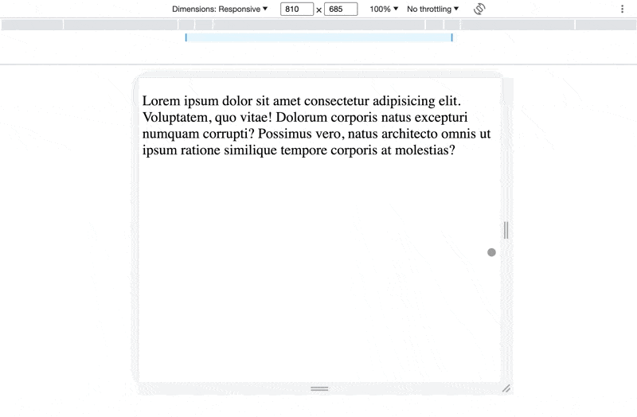
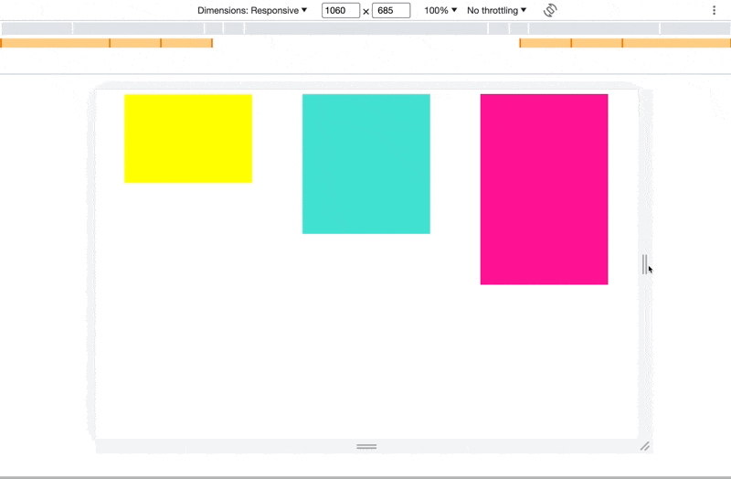
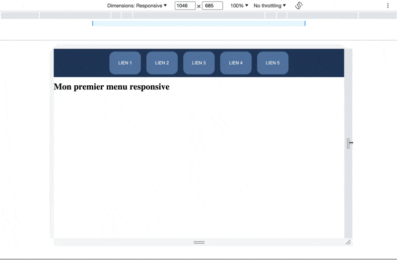
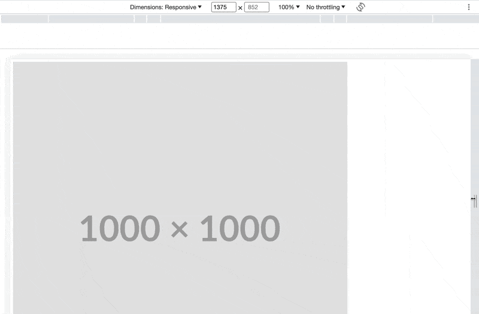

<!-- omit in toc -->
# Exercices Media Query

Voici quelques exercices pour un peu manipuler les media queries. Tu peux juste lire l'énoncé et regarder le gif pour essayer de reproduire l'effet. Je fournis également un pas à pas en guise de guide, mais il n'est pas forcément complet histoire que tu cherches un peu par toi même. Surtout prend le temps de tester différentes propriétés pour trouver la bonne à modifier!

<!-- omit in toc -->
## :memo: Objectifs

- Apprendre à manipuler les media queries
- Suivre des consignes précises.
- Apprendre à se débrouiller en allant lire la théorie vue ou la documentation.

<!-- omit in toc -->
## :white_check_mark: Evaluations

- Respect des consignes.
- La syntaxe est correcte.
- L'indentation est correcte.

<!-- omit in toc -->
## Légende des difficultés

Facile: 😄
Modéré: 😊
Exigeant: 😅
Épineux: 😰
Impossible?: 😡

<!-- omit in toc -->
## Table des matières

- [😄 Media Query de Base](#-media-query-de-base)
- [😊 Affichage de Blocs](#-affichage-de-blocs)
- [😅 Menu de Navigation Réactif](#-menu-de-navigation-réactif)
- [😊 Images Réactives](#-images-réactives)
- [😰 Disposition en Grille Réactive](#-disposition-en-grille-réactive)
- [😡 Formulaire responsive](#-formulaire-responsive)

## 😄 Media Query de Base

>Sujets: Media Query

Crée une page HTML avec un paragraphe de texte. Utilise une media query pour rendre le texte plus grand lorsque la largeur de l'écran est inférieure à 600 pixels.



1. Utilise `lorem` pour mettre du texte rapidement dans ton `<p></p>`
2. Ajoute ton CSS et met une taille de `2rem` à ton paragraphe.
3. Ajoute ta `media query` pour les `screen` et avec une largeur max de 600px
4. Ajoute dans ta MQ une règle CSS pour que la taille de ton `p` augmente à `3rem`

## 😊 Affichage de Blocs

>Sujets: Media Query, Flexbox

Crée trois blocs de couleur sur une page. Utilise des media queries pour changer leurs hauteurs et couleurs à différents points de rupture d'écran.



1. Ajoute une balise `<main></main>`
2. Ajoute 3 `div` à l'intérieur de `<main></main>`.
3. Fais en sorte que les `div` aient une taille et qu'elles s'affichent l'une à côté de l'autre.
4. Chaque `div` doit avoir une couleur spécifique (pseudo-sélecteur ou classe.. au choix... mais fais le bon! 😈)
5. Ajoute les MQ pour les écrans et pour une largeur minimum de 600, 800 et 1000px.
6. Change les propriétés des blocs pour chaque MQ. Tu n'est pas obligé de respecter exactement les tailles et couleurs qu'il y a sur le gif tant que le résultat des MQ est bien là.

## 😅 Menu de Navigation Réactif

Conçois un menu de navigation horizontal simple avec des liens. Utilise des media queries pour transformer le menu en une version verticale lorsqu'il est affiché sur un écran plus étroit.



1. Crée ton menu en HTML. Place le dans un `header`. Tu peux utiliser cette commande Emmet pour générer 5 liens rapidement: `li[href="#"]{Lien $}*5`
2. Pas besoin de recopier le style du gif, amuse toi!
3. Il va falloir faire en sorte que notre `ul` soit en `flex`, autorisé le `wrap` et centrer le tout à l'intérieur du `header`. N'oublie pas aussi d'enlever le style de la liste.
4. Ensuite tu peux styliser les `li` à ta guise.
5. Préparons notre MQ comme d'hab, cette fois on va mettre une `max-width:768px`.
6. Dans notre MQ on veut changer la direction de notre `ul` et la largeur de nos `li`
7. On peut également cibler certains de nos éléments pour changer leurs styles (voir gif)

## 😊 Images Réactives 

Insère une image dans ta page HTML et utilise la balise `<picture></picture>` pour avoir une image réactive. Regarde le .gif qui suit et [:book: relis la théorie](./02-theorie-responsive-design.md#images-responsive).



1. Insère la balise `<picture></picture>`
2. Ajoute ces images en tant que **source**. Ici on utilise un service de [placeholder](https://placehold.co/) pour nos images, c'est à dire que la taille de l'image est 
   - `https://placehold.co/600x400/png`
   - `https://placehold.co/800x600/png`
   - `https://placehold.co/1000x800/png`
3. Pour chacune des balises des images, placer la media query correspondante
   - max-width: 768px
   - max-width: 1000px
   - max-width: 1200px
4. Ajoute l'image de *sécurité* suivante: `https://placehold.co/1000x1000` qui devra s'afficher quand aucune des MQ n'est respectée (donc ici quand le viewport fait + de 1200px de large)

## 😰 Disposition en Grille Réactive

Crée une grille de cartes avec des images et des titres. Utilise une media query pour que les cartes prennent 100% de la largeur quand on passe sur une vue mobile large (**max-width:475px**).

Tu peux créer le style que tu veux et t'amuser avec les propriétés. Ou bien inspire toi de l'exemple


1. Englobe tes futures cards dans une balise `<main></main>`.
2. Crée l'HTML nécessaire pour créer une card. Il te faudra une `div.card`, une image aléatoire, une `div.details` qui comprend un `h2` et un `p`
   - :bulb: Pour l'image aléatoire tu peux utiliser [Placehold](https://placehold.co/) qu'on a utiliser dans l'exercice précédent ou alors [Picsum](https://picsum.photos/) pour avoir une photo plutôt qu'un placeholder.
   - Tu peux utiliser cette source pour tes images en changeant le numéro à la fin du paramètre `?random=*` pour générer une image aléatoire à chaque fois: `https://picsum.photos/350/250?random=1`
3. En CSS, il va falloir que `main` soit en `flex` avec certain paramètres pour que les cards s'affichent l'une à la suite de l'autre et passent à la ligne quand il n'y a plus de place.
4. La classe `.card` doit avoir une `width` spécifique (dans l'exemple: 350px). Tu peux styliser le reste de ta card comme bon te semble.
5. Ajoute la media query pour les **écran** de **475px max**. Change les propriétés de `.card`, `.details` et d'`img` pour faire en sorte que les cards s'affichent correctement en 100% de width.

> :bulb: Conseil: ne te focalise pas sur le style que j'ai employé spécialement. Essaye par toi même de trouver ton propre style, inspire toi d'autre sites. Bref, c'est le moment de t'amuser avec les tailles et les couleurs!

## 😡 Formulaire responsive

Alors pour cet exercice ce n'est pas le responsive qui est compliqué, c'est juste qu'il n'y a pas de pas à pas détaillé cette fois-ci. Il va falloir t'amuser à concevoir le style entièrement pour l'HTML fournit. Tu vas devoir faire appel à toutes tes connaissances en CSS pour y arriver, mais il n'y a rien de nouveau comme propriétés!

Il faut que le formulaire soit agencé correctement sur une page dont la largeur est importante, puis qu'il s'adapte sur mobile (**max-width:480px**).


```html
<div class="container">
   <h2>Formulaire de Contact</h2>
   <div class="form-group">
      <label for="nom">Nom :</label>
      <input type="text" id="nom" name="nom" required>
   </div>
   <div class="form-group">
      <label for="prenom">Prénom :</label>
      <input type="text" id="prenom" name="prenom" required>
   </div>
   <div class="form-group">
      <label for="dateNaissance">Date de Naissance :</label>
      <input type="date" id="dateNaissance" name="dateNaissance" required>
   </div>
   <div class="form-group">
      <label for="sujet">Sujet :</label>
      <input type="text" id="sujet" name="sujet" required>
   </div>
   <div class="form-group">
      <label for="message">Message :</label>
      <textarea id="message" name="message" rows="4" required></textarea>
   </div>
   <div class="form-group">
      <label for="fichier">Fichier :</label>
      <input type="file" id="fichier" name="fichier">
   </div>
   <button type="submit">Envoyer</button>
</div>
```

<!-- omit in toc -->
## Conclusion

Après tous ces exercices tu devrais avoir une bonne idée de comment utiliser les Media Queries. Ce n'est jamais très compliqué, c'est juste une réflexion à faire sur quelles propriétés changer pour que tout s'affiche correctement. Raison de plus pour garder le code le plus simple possible. Evite de mettre des classes à tout va et des propriétés non-nécessaire!
