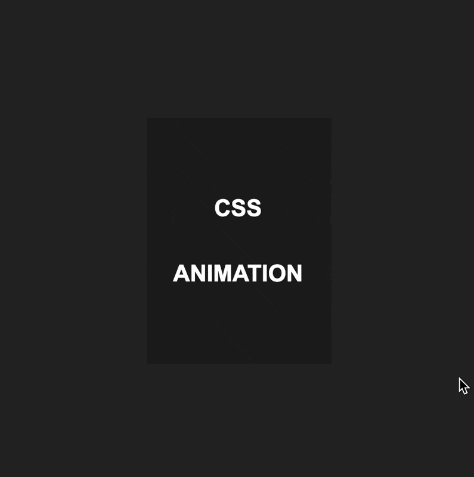

<!-- omit in toc -->
# Exercices Animations

Voici quelques exercices pour un peu manipuler les animations.

<!-- omit in toc -->
## :memo: Objectifs

- Apprendre à manipuler les animations
- Suivre des consignes précises.
- Apprendre à se débrouiller en allant lire la théorie vue ou la documentation.

<!-- omit in toc -->
## :white_check_mark: Evaluations

- Respect des consignes.
- La syntaxe est correcte.
- L'indentation est correcte.

<!-- omit in toc -->
## Légende des difficultés

Facile: 😄
Modéré: 😊
Exigeant: 😅
Épineux: 😰
Impossible?: 😡

<!-- omit in toc -->
## Table des matières

- [😄 Le cube qui bouge](#-le-cube-qui-bouge)
- [😄 Transition (W3School quiz)](#-transition-w3school-quiz)
- [😄 Animations (W3School quiz)](#-animations-w3school-quiz)
- [😅 Card animée](#-card-animée)
- [Feel the Music \& Head Hunter](#feel-the-music--head-hunter)
- [D'autres exercices arrivent...](#dautres-exercices-arrivent)

## 😄 Le cube qui bouge

- Créer une div de 200px de large et de hauteur.
- Créer une animation (keyframe) avec le nom `move`
- Définir un changement de couleur pour chaque pourcentage suivant: 0%, 25%, 50%, 75%, 100%
- Faire en sorte que le carré se déplace sur la page en suivant un chemin carré (voir exemple).
- Utilisez `animation-iteration-count` pour faire répéter l'animation à l'infini
- Utilisez `animation-direction` pour que l'animation se joue une fois à l'endroit et ensuite dans l'autre sens.

Voici un exemple, vous n'êtes pas obligé d'avoir exactement la même chose pour les couleurs.

## 😄 Transition (W3School quiz)

[Les exercices sont par ici](https://www.w3schools.com/css/exercise.asp?filename=exercise_css3_transitions1)

## 😄 Animations (W3School quiz)

[Les exercices sont par ici](https://www.w3schools.com/css/exercise.asp?filename=exercise_css3_animations1)

## 😅 Card animée

Reproduit le style de card dans l'exemple ci-dessous.

1. Créer une div avec la classe `card`
2. Créer une div avec la classe `card__inside`
3. Place un titre `h2` à l'intérieur de la div `card__inside`
4. Prépare `body` pour l'animation en lui donnant une hauteur de 100vh et un fond sombre. Utilise `flex` pour centrer le contenu.
5. Sélectionne `card` et donne lui une hauteur et largeur de 190px x 254px. Donne lui une couleur de fond en utilisant un `linear-gradient` et un `border-radius` de 20px.
6. Sélectionne `card__inside` et donne lui la même hauteur et largeur que `card`. Donne lui une couleur de fond foncé et un `border-radius` de 0px. Centre le contenu avec `flex` et arrange le texte comme bon te semble.
7. Sélectionne `card__inside` et ajoute le pseudo-sélecteur `:hover`. Utilise ensuite la propriété `transform` et la valeur `scale` pour très légèrement diminuer la taille. Ajoute ensuite un `border-radius` de 20px pour arrondir les coins. Tu peux également changer la taille et la couleur du texte.
8. Sélectionne `card` et ajoute le pseudo-sélecteur `:hover`. Ajoute un `box-shadow` pour donner un effet de profondeur à la carte. Tu peux utiliser la valeur suivante pour avoir un effet similaire à l'exemple: `0px 0px 30px 1px rgba(255, 102, 0, 0.3)`.
9. Terminons en ajoutant une transition sur `card__inside` et `card` pour que les changements se fassent en douceur. Utilise la propriété `transition` et la valeur `all 0.3s`.

## Feel the Music & Head Hunter

Reprend la maquette Feel the Music et/ou Head Hunter et ajoute des animations. Par exemple fait en sorte que les bulles en arrière-plan de la page principale se déplace constamment sur ta page. Ou bien anime les boutons ou la photo de la femme. Anime tous les éléments à droite sur la page Head Hunter. Bref, c'est le moment d'expérimenter et de t'amuser!

## D'autres exercices arrivent...

*Très prochainement... si vous êtes sages!* 😇

[:rewind: Retour au sommaire du cours](./README.md#table-des-matières)
