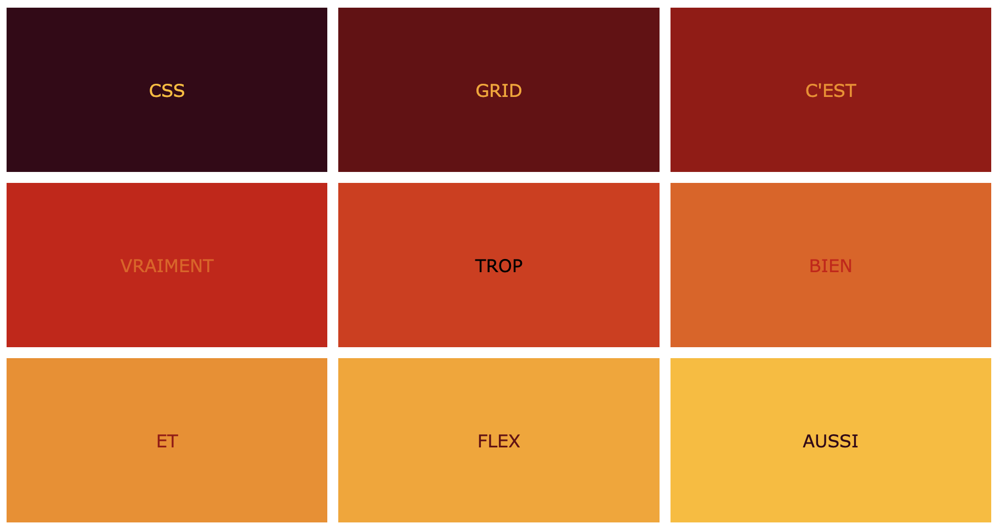

<!-- omit in toc -->
# Exercices CSS Grid

Voici quelques exercices pour un peu manipuler les animations.

<!-- omit in toc -->
## :memo: Objectifs

- Apprendre à manipuler CSS Grid
- Suivre des consignes précises.
- Apprendre à se débrouiller en allant lire la théorie vue ou la documentation.

<!-- omit in toc -->
## :white_check_mark: Evaluations

- Respect des consignes.
- La syntaxe est correcte.
- L'indentation est correcte.

<!-- omit in toc -->
## Légende des difficultés

Facile: 😄
Modéré: 😊
Exigeant: 😅
Épineux: 😰
Impossible?: 😡

<!-- omit in toc -->
## Table des matières

- [😄 \> 😰 CSS Grid Garden](#---css-grid-garden)
- [😄 Créer une grille basique](#-créer-une-grille-basique)
- [😊 Créer une grille basique et y placer des éléments](#-créer-une-grille-basique-et-y-placer-des-éléments)
- [Pixel art "facile"](#pixel-art-facile)
- [😰 Ghosty, le gentil petit fantôme](#-ghosty-le-gentil-petit-fantôme)

## 😄 > 😰 CSS Grid Garden

[](https://cssgridgarden.com/#fr)

Tout comme pour Flexbox, voici un jeu pour vous apprendre à utiliser grid. Essaye d'aller le plus loin possible.

## 😄 Créer une grille basique

**Objectif :** Créer une grille de 3x3 (trois colonnes et trois rangées) où chaque cellule a une taille égale.



**Instructions :**

- Utilise display: grid pour définir un conteneur grid.
- Définis trois colonnes et trois rangées de taille égale.
- Place un élément avec du texte dans chaque cellule de la grille.
- Utilise la propriété `grid-gap` pour ajouter un espace entre chaque cellule.
- Utilise la propriété `background-color` pour ajouter une couleur de fond différent à chaque cellule.
- Utilise **flexbox** pour centrer le texte dans chaque cellule.

> :bulb: Aide toi de la fonction `repeat()` pour définir les colonnes et les rangées ainsi que de l'unité de mesure `fr`.

## 😊 Créer une grille basique et y placer des éléments

**Objectif :** Avoir plusieurs éléments dans un conteneur grid et les placer à des positions spécifiques.


**Instructions :**

- Utilise display: grid pour définir un conteneur grid.
- Définis quatre colonnes et cinq rangées de taille égale.
- 

> :bulb: Aide toi de la fonction `repeat()` pour définir les colonnes et les rangées ainsi que de l'unité de mesure `fr`.

## Pixel art "facile"

On va créer un pixel art. Pour cela, on va utiliser une grille de 10x10. Chaque cellule de la grille aura une taille de 50px par 50px. Ensuite on va reproduire l'image ci-dessous 

## 😰 Ghosty, le gentil petit fantôme

**Objectif :** Réalisez un fantôme du jeu Pac-Man en utilisant une grille de 14x14. Et soyons fou, l'animé avec un mouvement de va et vient vertical.


**Instructions :**

- Réalise une grille de 14x14 avec une taille de cellule de 50px par 50px.
- A l'intérieur de ta grille, en html, tu auras besoin de placer des `div` vides par rangé ou colones.
- Pour les rangés ou colones où il n'y a qu'une seule couleur c'est facile, tu la sélectionnes en CSS et tu lui dit avec `grid-column` ou `grid-row` de prendre toute la place nécessaire. Tu auras besoin de `span` et du `/` pour cela. Exemple : `grid-column: 1 / span 14;`
- Pour les rangés ou colones où il y a plusieurs couleurs, tu vas devoir placer plusieurs `div` et leur donner une couleur. Pour ce faire tu peux simplement préparer des classes différentes pour chaque couleurs et les appliquer aux `div` que tu auras placé toujours avec la technique vue plus haut. Exemple :
  
```html
  <!-- row 6 -->
    <div class="row6-1 red"></div>
    <div class="row6-2 white"></div>
    <div class="row6-3 blue"></div>
    <div class="row6-4 red"></div>
    <div class="row6-5 white"></div>
    <div class="row6-6 blue"></div>
```

> :bulb: Expérimente! Ne te laisse pas décourager par les difficultés. Tu peux y arriver! Ouvre ton inspecteur et joue avec les propriétés CSS de grid jusqu'à trouvé la bonne solution!

