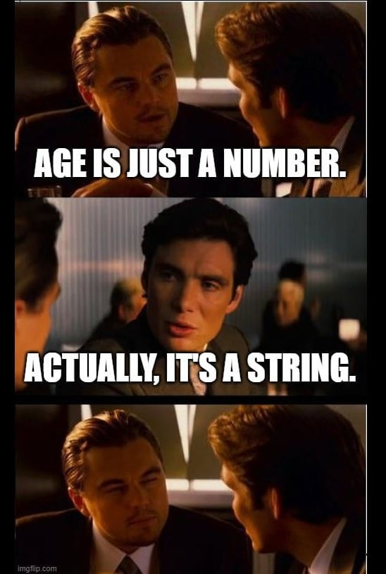
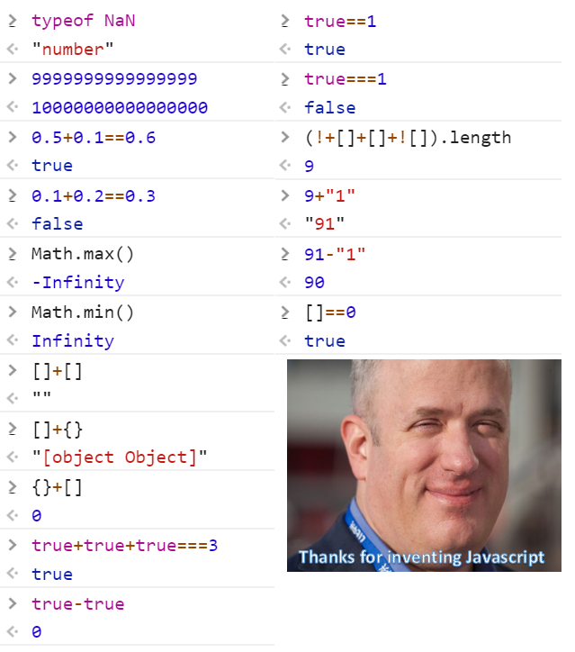

<!-- omit in toc -->
# JavaScript - les bases

JavaScript est un langage de programmation utilisé principalement pour rendre les pages web interactives. C’est un langage interprété, ce qui signifie qu’il est exécuté directement par le navigateur sans besoin de compilation préalable. Ce cours d’initiation vous apprendra les bases nécessaires pour créer des programmes simples en JavaScript.

🚨 Attention, ne dites jamais "Java" en parlant de "JavaScript", même si ils contiennent tous les deux le mot "Java" ce sont deux langages de programmations bien différents!

<!-- omit in toc -->
## Table des matières

- [Principe de base d'écriture du JS](#principe-de-base-décriture-du-js)
  - [Code directement dans la balise `<script>` (Inline JavaScript)](#code-directement-dans-la-balise-script-inline-javascript)
  - [Code dans un fichier JavaScript externe](#code-dans-un-fichier-javascript-externe)
  - [Quand utiliser quelle méthode ?](#quand-utiliser-quelle-méthode-)
  - [Conclusion](#conclusion)
- [Console.log](#consolelog)
- [Variables](#variables)
- [Types de données](#types-de-données)
  - [String](#string)
  - [Number](#number)
  - [Boolean](#boolean)
  - [Array](#array)
  - [Object](#object)
  - [null et undefined](#null-et-undefined)
  - [Conclusion](#conclusion-1)
- [Conditions](#conditions)
- [Boucles](#boucles)
- [Fonctions](#fonctions)
- [Tableaux](#tableaux)
- [Objets](#objets)

## Principe de base d'écriture du JS

Tout d'abord, on va devoir écrire notre JavaScript quelque part. Tout comme pour l'HTML et le CSS, il y a un endroit bien spécifique pour. Soit on l'insère directement dans notre page HTML, mais du coup le code sera utilisable que sur cette page et risque d'agrandir le nombre de lignes de code de notre fichier HTML et par conséquent le rendre moins lisible. Ou alors on peut tout simplement créer une page `.js` qui contiendra notre code et qu'on appellera sur notre page HTML, comme notre CSS.

### Code directement dans la balise `<script>` (Inline JavaScript)

```html
<html>
<head>
    <title>Exemple</title>
</head>
<body>
    <h1>Bonjour</h1>

    <script>
        console.log('Ceci est du JavaScript inline'); // Cette ligne, c'est du JavaScript
    </script>
</body>
</html>
```

<!-- omit in toc -->
#### Avantages JS inline

- **Simple et rapide** pour les petits scripts ou des tests rapides.
- **Accès direct au DOM** juste après l’insertion de la balise `<script>`, surtout si elle est placée à la fin du document.
- **Pas de requête HTTP supplémentaire** pour récupérer un fichier JS externe, donc moins de latence.

<!-- omit in toc -->
#### Inconvénients JS inline

- **Moins maintenable** à mesure que le code grossit : si votre projet devient grand, le code inline peut rendre l’organisation difficile.
- **Problèmes de sécurité** potentiels liés au Cross-Site Scripting (XSS). Placer du code JavaScript directement dans l’HTML peut rendre votre site plus vulnérable aux injections de scripts malveillants.
- **Réutilisation difficile** : il est plus compliqué de réutiliser le même code sur différentes pages, car vous devrez le copier/coller manuellement.
- **Mélange de contenu et de comportement** : cela va à l’encontre des bonnes pratiques de séparation du code (HTML pour le contenu, CSS pour le style, JavaScript pour le comportement).

### Code dans un fichier JavaScript externe

```html
<html>
<head>
    <title>Exemple</title>
    <script src="script.js"></script>
</head>
<body>
    <h1>Bonjour</h1>
</body>
</html>
```

<!-- omit in toc -->
#### Avantages fichier externe

- **Meilleure organisation** : séparer le code JavaScript du HTML améliore la lisibilité et la maintenabilité.
- **Réutilisable** : un fichier JavaScript externe peut être réutilisé sur plusieurs pages, évitant la duplication de code.
- **Meilleure sécurité** : il est plus difficile d’introduire des failles XSS avec du JavaScript dans un fichier externe, surtout si les bonnes pratiques de sécurité (comme les en-têtes de sécurité HTTP) sont respectées.
- **Amélioration des performances** : un fichier JavaScript externe peut être mis en cache par le navigateur, ce qui améliore la performance des visites répétées.
- **Séparation des préoccupations** : garder le JavaScript dans un fichier séparé respecte le principe de séparation des préoccupations entre le HTML (structure), le CSS (style), et le JavaScript (comportement).

<!-- omit in toc -->
#### Inconvénients fichier externe

- **Requête HTTP supplémentaire**: l’utilisation d’un fichier externe nécessite une requête HTTP pour charger le fichier, ce qui peut introduire une légère latence (même si cela peut être minimisé par le cache).
- **Nécessité de connexion** : si le fichier JS externe n’est pas accessible (par exemple en cas de problème de serveur), le code ne s’exécutera pas.

### Quand utiliser quelle méthode ?

- **Inline JavaScript** (dans la balise `<script>`) est généralement utilisé pour les petits scripts, les tests rapides, ou lorsqu’il n’est pas nécessaire de réutiliser le code ailleurs. C’est également une bonne option pour des cas simples où la performance est critique et que vous voulez éviter des requêtes supplémentaires.
- **JavaScript externe** est recommandé pour les projets plus importants ou complexes, ou lorsque vous avez besoin de réutiliser le code sur plusieurs pages. Cela permet une organisation plus claire et suit les bonnes pratiques de développement.

### Conclusion

Bien que les deux approches fonctionnent, le JavaScript dans un fichier externe est généralement préféré dans les projets de taille moyenne à grande en raison des avantages liés à l’organisation, à la "réutilisabilité" et à la sécurité. Le JavaScript inline est utile pour les scripts simples, mais il peut devenir difficile à gérer dans des applications plus complexes.

## Console.log

On va souvent avoir besoin de tester notre script tout au long de sa conception. Pour ce faire il nous faut une méthode simple et efficace pour vérifier si ça fonctionne ou non. C'est là qu'entre en jeu notre premier bout de code: `console.log()`. Celui-ci va nous permettre d'afficher des messages dans la console de notre navigateur ou de VSCode pour vérifier si tout se passe comme prévu. 

Vous pouvez retrouver votre console dans les outils de développements de votre navigateur (F12 ou inspecter).

**Exercice pratique**

Pour utiliser `console.log()` c'est fort simple, suivez les étapes suivantes:

1. Créez un nouveau fichier HTML comme d'habitude.
2. Dans la balise `<body>` on va insérer une balise `<script>`
3. A l'intérieur de `<script>` écrivez simplement `console.log()`
4. Ensuite à l'intérieur des parenthèses on va ajouter des guillemets et écrire un petit mot entre les guillemets
5. Ensuite ouvrez la page dans votre navigateur, ouvrez les outils de développements (F12) et allez dans l'onglet "Console" pour y retrouver votre message.

```js
console.log("Hello World!")
```

Bravo, tu as réalisé ta première ligne de code JavaScript! 🎉

Par après `console.log()` nous servira à de multiples occasions pour vérifier nos fonctions et autres bouts de code JS.

## Variables

Un des premiers concept à appréhender en JavaScript c'est le principe d'une variable.

Une variable c'est un espace de stockage pour des valeurs. Vous pouvez déclarer des variables en utilisant les mots-clés `var`, `let`, ou `const`. Cela permet d'accéder à ces informations pour les réutiliser ou les modifier dans le processus de notre programme/fonctionnalité.

-**var** : utilisé pour déclarer des variables, mais a un comportement global ou fonctionnel.
-**let** : similaire à var, mais sa portée est limitée au bloc de code dans lequel elle est déclarée.
-**const** : pour les variables dont la valeur ne doit pas changer.

```js
var ville = "Paris"; // portée globale ou fonctionnelle
let nom = "Alice"; // variable modifiable
const age = 30;    // variable constante
```

Pour le moment on a pas encore parlé de porté ou **scope**, donc ne vous en faite pas et utiliser **tout le temps** `let` et tout ira bien. `var` est plus dangereux à utiliser car vous risquer d'avoir des problèmes plus vite. Mais il est juste bon de savoir que ça existe car vous allez souvent trouver des exemples de codes encore écrit avec `var`.

<!-- omit in toc -->
### Utilisation des variables

Alors c'est encore une fois très simple pour le moment, on va tout simplement écrire notre variable et lui dire ce qu'elle doit contenir, ensuite on y accédera et l'affichera dans notre console. Pour ce faire on écrit `let` suivi du nom que l'on veut donner à notre variable, ensuite un signe égale puis la valeur.

**Exercice pratique**

1. Dans votre page précédente, ajouter au dessus de votre `console.log("")` une nouvelle ligne.
2. Ajouter la variable `nom` et `prénom` en utilisant `let`.
3. Ajouter une valeur texte entre guillemets avec votre nom et prénom
4. Ajouter ensuite une nouvelle variable constante avec votre âge. Ici il s'agit d'une valeur numérique, pas besoin de guillemets. On verra plus tard pourquoi.
5. Il est temps d'afficher tout ça dans notre console. Ajouter 3 `console.log()` à la suite de celle de l'exercice précédent.
6. Pour chacun de ces `console.log()` on va appeler une variable. Insérer entre parenthèse le nom de la variable. **Attention** cette fois-ci on ne met pas de guillemets car ce n'est pas du texte que l'on veut afficher mais le contenu d'une variable.
7. Regardez ensuite votre console pour voir si vous voyez les différentes valeurs que vous avez stockés.

## Types de données

Maintenant que l'on sait comment stockés des données, voyons un peu quelques types de données spécifiques au JS. En effet, pour créer du code fonctionnel il faut bien faire comprendre à l'ordinateur ce avec quoi on travail. Les types de données en JavaScript sont essentiels pour comprendre comment manipuler et traiter l’information dans vos programmes. Ils définissent la nature des valeurs que vous pouvez stocker dans les variables et utiliser dans vos opérations. Est-ce que c'est du texte? Un chiffre? Un tableau? Un objet? Il va falloir faire preuve de rigueur pour utiliser correctement ces données pour éviter tout problème dans notre future code.

Les principaux types de données en JavaScript sont :

-**String** : Chaînes de caractères
-**Number** : Nombres (entiers ou décimaux)
-**Boolean** : true ou false
-**Array** : Tableaux (collection de données)
-**Object** : Objets (données structurées)

```js
let texte = "Bonjour"; // String
let nombre = 42;       // Number
let estVrai = true;    // Boolean
let tableau = [1, 2, 3]; // Array
let objet = { nom: "Alice", age: 30 }; // Object
```

### String

Une chaîne de caractères (ou string) est une série de caractères entourée de guillemets simples ('), doubles (") ou backticks (`) pour les chaînes de caractères multi-lignes et les templates de chaînes.

```js
let message = "Bonjour";
let salutation = 'Salut';
let templateString = `Ceci est une chaîne de caractères avec des backticks`;
```

Les chaînes de caractères sont immuables, ce qui signifie qu’une fois créées, elles ne peuvent pas être modifiées directement. Par exemple, si vous essayez de changer un caractère d’une chaîne, cela ne fonctionnera pas. Il y a des méthodes pour le faire, mais ce n'est pas le sujet de ce cours pour l'instant.

### Number

Le type number représente à la fois les entiers et les nombres à virgule flottante (nombres décimaux). Il n’y a pas de distinction entre les deux en JavaScript.

```js
let entier = 42;
let decimal = 3.14;
```

JavaScript prend en charge des opérations mathématiques comme l’addition, la soustraction, la multiplication, la division et le modulo. Nous exécuterons ce genre d'opération plus tard. 

```js
let number = 42; 
let string = "42";
```

Si on essaye d'utiliser les deux variables plus haut pour les additionner on aura pas du tout "84" comme résultat, car l'un est un number mais l'autre un string. C'est là qu'il faut faire attention.



### Boolean

Un type boolean ne peut avoir que deux valeurs : true (vrai) ou false (faux). Ce type est principalement utilisé dans les conditions et les comparaisons. Nous verrons ce sujet un peu plus tard.

```js
let estMajeur = true;
let aFiniLaTache = false;
```

Les booléens sont souvent le résultat d’opérations de comparaison :

```js
let x = 10;
let y = 5;

// On vérifie si x est plus grand que y et on affiche le résultat dans la console
console.log(x > y);   // true
// On vérifie si x est égale à y et on affiche le résultat dans la console
console.log(x === y); // false
```

### Array

Un tableau est une collection ordonnée d’éléments. En JavaScript, les tableaux peuvent contenir des valeurs de différents types (nombres, chaînes, objets, etc.). On crée un tableau en ouvrant des crochets et en séparant les données par des virgules.

```js
let nombres = [1, 2, 3, 4, 5];
let melange = ["Bonjour", 42, true];
```

Les éléments d’un tableau sont accessibles via leur indice, qui commence à 0 :

```js
let fruits = ["Pomme", "Banane", "Orange"];
console.log(fruits[0]); // "Pomme"
console.log(fruits[1]); // "Banane"
```

On peut manipuler ces tableaux mais ça sera pour plus tard aussi.

### Object

Un objet est une collection de paires clé-valeur. Contrairement aux tableaux, qui sont des listes ordonnées, les objets sont des collections où chaque valeur est associée à une clé (ou propriété).

```js
let personne = {
  nom: "Alice",
  age: 30,
  ville: "Paris"
};
```

Vous pouvez accéder aux valeurs des propriétés d’un objet en utilisant la notation par point ou la notation par crochets :

```js
console.log(personne.nom);     // "Alice"
console.log(personne["ville"]); // "Paris"
```

Comme pour les tableaux on peut apprendre à manipuler ces objets, tout cela ferra l'objet d'un cours spécifique, ne vous en faites pas.

### null et undefined

Une variable est **undefined** lorsqu’elle a été déclarée mais n’a pas encore reçu de valeur.

```js
let x;
console.log(x); // undefined
```

Une valeur qui représente volontairement “aucune valeur” est dites **null**. C’est souvent utilisé pour indiquer qu’une variable est vide intentionnellement.

```js
let y = null;
console.log(y); // null
```

### Conclusion

Tout ceci fait beaucoup d'information d'un coup, mais c'est la base qu'il faut comprendre pour pouvoir commencer son périple en JavaScript. Vous allez forcément vous tromper dans les types de données que vous utiliserez au début, c'est tout à fait normal, JS peut être très bordélique au début, mais vous verrez que très vite tout ferra sens.



## Conditions

## Boucles

## Fonctions

## Tableaux

## Objets